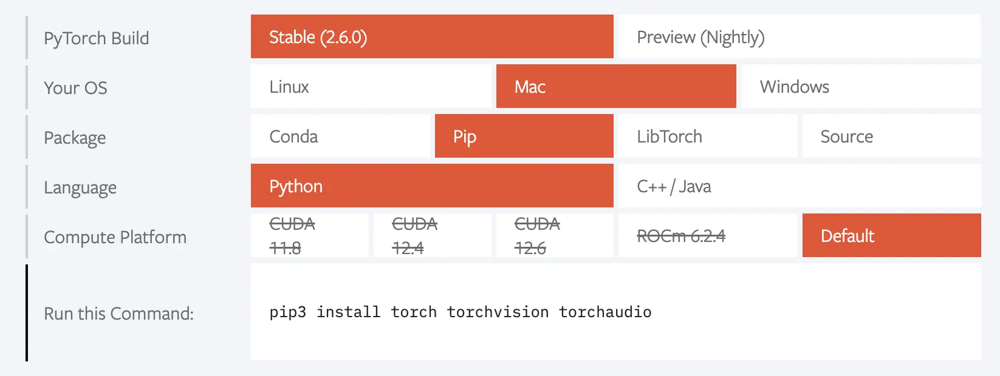

# PEP ### - Wheel Variants

| Resource            | Link                                                                                                                                     |
| ------------------- | ---------------------------------------------------------------------------------------------------------------------------------------- |
| `PEP Link`          | `To Be Published`                                                                                                                        |
| `DPO Discussion`    | [Implementation variants: rehashing and refocusing](https://discuss.python.org/t/implementation-variants-rehashing-and-refocusing/54884) |
| `Github Repository` | <https://github.com/wheelnext/pep_xxx_wheel_variants>                                                                                        |

## Abstract

This PEP proposes an evolution of Python Wheels standard to support hardware-specific or platform-dependent package variants.
Current mechanisms for distinguishing Python Wheels (i.e Python ABI version, OS, CPU architecture, and Build ID) are
insufficient for modern hardware diversity, particularly for environments requiring specialized dependencies such as
high performance computing, hardware accelerated software (GPU, FPGA, ASIC, etc.), etc.

This proposal introduces `Wheel Variants`, a mechanism for publishing platform-dependent wheels and selecting the most suitable
package variant for a given platform.

To enable fine-grained package selection without fragmenting the Python ecosystem, this PEP proposes:

- A `Wheel Variant` system that enables multiple wheels for the same Python package version, distinguished by
hardware-specific attributes.

- A `Provider Plugin` system that dynamically detects platform attributes and recommends the most suitable wheel.

- A hash-based identification mechanism for wheel variants, ensuring compatibility while maintaining clarity in package naming.

This approach allows seamless package resolution without requiring intrusive changes to `installers`, ensures backward
compatibility, and minimizes the burden on package maintainers.

## Motivation

Existing approaches to handling platform-specific Python packages are suboptimal. Some methods include maintaining
separate package indexes for different hardware configurations, bundling all potential dependencies into a single
"mega-wheel," or creating separate package names (`mypackage-gpu`, `mypackage-cpu`). Each of these approaches has
significant drawbacks, such as excessive binary size, dependency confusion, and inefficient dependency resolution, etc.

The need for a systematic and scalable approach to selecting optimized wheels based on platform characteristics has
become increasingly urgent as Python usage expands across diverse computing environments, from cloud computing to
embedded systems and AI accelerators.

## Rationale

### User Stories

- A user wants to install a version of NumPy that is specialized for their CPU architecture.

- A user wants to install a version of PyTorch that is specialized for their GPU architecture.

- A user wants to install a version of mpi4py that has certain features enabled (e.g. specific MPI implementations for
their hardware).

- A library maintainer wants to build their library for wasm32-wasi with and without pthreads support.

- A library maintainer wants to build their library for an Emscripten platform for Pyodide with extensions for graphics
compiled in.

- A library maintainer wants to provide packages of their game library using different graphics backends.

- SciPy wants to provide packages built against different BLAS libraries, like OpenBLAS and Accelerate on macOS. This is
something they [indirectly do today](https://github.com/wheelnext/wheelnext/pull/2#discussion_r1957200935)

- Manylinux standard doesn’t cover all use-cases: [github.com/pypa/manylinux/issues/1725](https://github.com/pypa/manylinux/issues/1725)

### Wheel Variants

### Opt-in vs. opt-out

A critical early design point was whether installing wheel variants when they were published for a package, was supposed
to be opt-in or opt-out. An early proposal
was to make them opt-in, possibly by requiring the user to manually install specific plugins. Then the installer would
use all the plugins found in the environment to determine whether variants are supported. It was pointed out that this
design would hamper the adoption of wheel variants and be a suboptimal solution to the original problem, given that
the users would need to be explicitly aware whether any packages (either installed directly or as a dependency) provide
wheel variants, and then find out which plugin packages they need to install in order to enable them. Furthermore,
the necessity of manually keeping the plugins in acceptable version ranges could cause a significant maintenance burden.

Instead, an opt-out approach was taken, with plugins being automatically installed into an isolated environment. This
approach ensures that variants work out of the box, and users can benefit from them with minimal maintenance burden.
To satisfy the localized need for an opt-in solutions, providers can be marked optional — in which case they must be
enabled explicitly but still benefit from automatic provider installation.

#### Wheel filename

In order to distinguish different variants, a variant label was added to the filename. The label is added as the very
last component to make it easy to distinguish different variants.

The model defaults to using a hash to provide unique and reproducible filenames out of the box. However, it
permits explicitly choosing a different label to make variants easy to recognize by humans. The label length
is strictly limited to prevent the wheel filenames to become much longer than they are now, and causing issues
on systems with smaller filename or path length limits.

The same `-` character is used as the separator to reduce the risk of existing package manager implementations
accidentally choosing a potentially unsupported wheel variant instead of a regular wheel. This was based on a survey
of wheel filename verification methods used by different package managers and libraries (packaging, poetry, pip, uv).
Both the current specification and some implementations are very permissive about different components, yet they all
reject wheels if there are more than six components, or the build tag does not start with a digit. A limitation of this
choice is that it assumes that the python tag will never start with a digit.

#### Variant properties

Variant properties follow a key-value design, where namespace and feature name constitute the key. Namespaces are used
to group features defined by a single provider, and avoid conflicts should multiple providers define a feature with
the same name. The character sets for all components are restricted to make it easier to preserve consistency
between different providers, in particular uppercase characters are rejected to avoid different spellings of the same
name. The character set for values is more relaxed, to permit values resembling versions and version
specifications.

Multiple values are permitted as a logical disjunction, while different features are treated conjunctively. This is
meant to provide some flexibility in designating variant compatibility while avoiding having to implement a complete
boolean logic. This flexibility is further extended via the concept of dynamic plugins, permitting the values to
be dynamically interpreted, e.g. as version ranges.

#### Variant hash

Variant hash is used as a stable and unique identifier for every set of variant properties. It is truncated to
8 characters to ensure that filenames remain short. SHA256 algorithm was chosen, because it is already widely
used in wheels, in the `RECORD` file and therefore the package managers do not have to implement an additional
algorithm.

To ensure reproducible hash values, properties are sorted before hashing. They are then serialized into a canonical
string form, and each one is terminated with a newline character to ensure their separation.

As a special case, a variant hash of `00000000` is used for the null variant, to make it easily distinguishable
from other variants.

#### Null variant

The concept of a null variant was added to make it possible to distinguish a fallback wheel variant from a regular wheel
published for backwards compatibility. For example, a package that features optional GPU support could publish
the following wheels:

1. One or more GPU wheel variants that is installed on systems with wheel variant support and a suitable GPU.

2. A CPU-only null variant that is installed on systems with wheel variant support but without suitable GPU.

3. A GPU+CPU regular wheel that is installed on systems without wheel variant support.

In particular, this makes it possible to publish a smaller null variant for systems that do not feature suitable GPUs,
with a fallback regular wheel with support for CPU and all GPUs for systems where variants are not supported
and therefore GPU support cannot be determined.

Publishing a null variant is entirely optional. If one is missing, then the non-variant wheel is used instead.
The non-variant wheel is also used if variant support is explicitly disabled.

### Plugin API

#### General design

The plugin API was largely inspired by [PEP 517](https://peps.python.org/pep-0517/). However, it was extended to support
classes that are instantiated, to facilitate single initialization and clean caching of plugin state between
multiple method calls. For the convenience of plugin authors, both class-level and module-level (with global variables
and functions) API implementations are supported.

For the primary use in building packages and installing wheel variants, the plugin API endpoint is either specified
explicitly or inferred from requirements. Support for the latter was added as the need to explicitly guess the correct
`build-backend` value was noted as a significant shortcoming of PEP 517. However, for the convenience of package
developers, plugins are recommended to install entry points as well. Thanks to that, the developer can install
the relevant provider plugins to their system, and variant-related tooling will be able to automatically discover it
and obtain the correct API backend values.

The API means to be absolutely minimal and is specified using abstract protocols. Its centerpiece is a function that
allows a frontend to query the configs supported on the current platform (`get_supported_configs()`). Additionally,
a plugin declares the namespace it uses (`namespace`), whether it is a static or dynamic plugin (`dynamic`)
and exposes a function to validate properties (`validate_property()`).

The namespace is declared globally and is avoided in return values to avoid redundancy and the need to handle potential
mismatches. All methods are only passed properties in the plugin namespace to make plugin implementation easier,
and avoid the need for explicit filtering, that if accidentally omitted could result in mistakenly processing properties
from another namespace.

The `validate_property()` method is provided for build backends to ensure that wheel variants are not built with
incorrect properties. It operates on one property at a time to simplify the return value, since calling it
multiple times is not considered a bottleneck.

The types used in the API are defined using abstract protocols, in order not to force a specific implementation.
For example, the relevant data types can be implemented using data classes, named tuples, `argparse.Namespace`
or an entirely custom class.

#### Static and dynamic plugins

The split into static and dynamic plugins was introduced to handle diverse use cases for wheel variants. In particular,
it was pointed out that the static design cannot handle use cases where compatible values cannot be predicted up front
and restricted to a fixed list. For these cases, the API permits the plugin to intelligently process the actual property
values specified at build time, for example as version ranges.

At the same time, the support for the static approach to plugins was preserved to facilitate better caching
and the ability to pin variants easier for the use cases that do not need dynamic processing.

Both versions of the API use the same prototypes to avoid maintaining two divergent API documentations, and to make it
easier to convert plugin from one type to another. The only difference is in the value of `known_properties` argument
to `get_supported_configs()`, that explicitly takes `None` for static plugins to avoid accidentally depending on this
data in static plugins.

### Variant information

#### Format and locations

The variant information format is meant to cover the complete pipeline from building wheels to installing them. It
includes both information needed to build wheel variants and to install them. The information is initially included
in project's `pyproject.toml` file, then copied verbatim into `variant.json` in the built wheel. From there, it is
copied to `*-variants.json` file on the index, where it enables installers to filter and sort the supported wheel
variants without having to fetch all of them. This is similar in principle to [PEP 658](
https://peps.python.org/pep-0658/) that enables serving the distribution metadata via an additional URL.

For project-level configuration, the `pyproject.toml` format was selected as specified in [PEP 518](
https://peps.python.org/pep-0518/), and frequently used for project metadata and tool configuration. For wheel-level
information, a JSON file is used instead, as a format intended exclusively for machine processing and supported by all
Python versions. The same format is used e.g. in [PEP 770](https://peps.python.org/pep-0770/) that is also included
in the `.dist-info` directory. For the same reasons, JSON is also used for `*-variants.json` on the index.

A separate `variant.json` file is used in the `.dist-info` directory to minimize the risk of interoperability
issues and to make the implementation as simple as possible. In particular, given different implementations of code
responsible for reading and writing `METADATA` and `WHEEL` files in different package managers (some expecting
dictionaries, others serialized data), a solution that uses a separate file made providing the data via a single
reusable library easier.

All files use the same (deserialized) structure to make the respective implementation code reusable, and to make
transitioning the data between files as easy as possible. The `pyproject.toml` file includes data that is not strictly
relevant to building, to keep all the configuration in a single location. The complete information is copied verbatim
into the wheel, to facilitate the ability of constructing `*-variants.json` for index using prebuilt wheels alone.

The `*-variants.json` files are generated separately for every package version. This makes it possible to upload them
along with every new version without having to update the previous file. It also makes it possible for the index
to generate the file after all files for a version have been uploaded, similarly to the `.metadata` files.

#### Provider information

All providers are keyed on their namespaces, to permit matching them easily to variant properties. The two
most important data are the `requires` key that is necessary to automatically install the provider plugin and therefore
enable automatic selection of variants, and the `plugin-api` key that provides flexibility in layouting the plugin
to the author's wishes.

The `requires` key permits uses standard Python dependency specifier syntax, and permits multiple values similarly
to the dependency specifiers used elsewhere in package management context. For user convenience, `plugin-api` is
optional and defaults to the value inferred from the first package in `requires` — this aims to reduce the need
of having to explicitly look up the correct `plugin-api` value when using a provider plugin. Ideally, `plugin-api` would
only be explicitly declared in special cases. When constructing the default value, `-` are replaced by `_` since
the former is not valid in `import` statements and can be relatively common in distribution names; other characters are
not normalized since packages follow different conventions on matching distribution names to import names.

The `enable-if` key was added to enable cleanly restricting the systems on which the provider is used,
and therefore avoiding installing unnecessary provider plugins on systems where they always report no compatible
variant properties. For example, providers handling compatibility with specific CPU features need only to be installed
on systems with specific CPU architectures.

The `optional` key was added to add an ability to make some of the variant providers optional. The requested use case
is the ability to avoid installing plugins for rarely used variants by default.

#### Default priorities

Provider plugins define the features and their values in a specific order. However, the ordering between different
plugins is undefined. Therefore, it is necessary for every package to specify the requested ordering for namespaces.

The format also permits packages to override the preference order initially specified by the plugins, for features
within every namespace, and for property value for
every feature. The overrides are scoped to allow specifying features or property values that have higher
significance without needing to explicitly cover all the features or properties used by the package.

#### Variants

The built variant properties are not fixed and therefore are not part of `pyproject.toml`. However, they are added
to the same structure in `variant.json` to avoid introducing additional variant information files. The same format
is reused both in `*.dist-info/variant.json` and `*-variants.json` files, with the difference that in the former file
it specifies only the single variant, while in the latter all wheel variants available. This makes it possible to easily
construct the latter file by merging the JSON from individual wheels.


## Specification

### Wheel Variants

Wheel Variants provide the ability to parametrize built wheels beyond the scope currently permitted by wheel tags.
Every variant is described by zero or more properties that are defined and controlled by provider plugins. The plugins
provide a standardized Python API to determine which variants are supported by the system, and to order them according
to preference in installing.

#### Wheel filename

This specification extends the wheel filename to include an optional variant label. The complete filename follows
the following pattern:

```
{distribution}-{version}(-{build tag})?-{python tag}-{abi tag}-{platform tag}(-{variant label})?.whl
```

Files not featuring the `variant label` part are regular wheels. Variant wheels use it to uniquely identify each
variant. It can either be a 8-character variant hash, or a custom string of 1 to 8 ASCII characters from the range
`[a-z0-9._]`.

For example, the following are valid wheel variant names:

```
mypackage-0.0.1-py3-none-any-fa7c1393.whl
mypackage-0.0.1-cp310-abi3-manylinux_2_28_x86_64-fast.whl
mypackage-0.0.1-3-py3-none-any-fa7c1393.whl
```

#### Variant properties

Each variant is described using zero or more properties. A property is a string of the following form:

```
namespace :: feature :: value
```

The `namespace` is defined by the provider plugin, and all properties defined by the provider use the same namespace.
The `feature` specifies the property name, and `value` the corresponding property value. Both `namespace` and `feature`
are ASCII strings of characters in the range `[a-z0-9_]`, while `value` of characters in the range `[a-z0-9_.,!>~<=]`.

A single variant can include multiple features from a namespace, and multiple values for the feature.
For a feature to be considered compatible with the sytem, the provider must indicate that *at least one* of its values
is compatible. For a wheel to be considered compatible, *all* of its features must be compatible.

For example, the following set of features:

```
myprovider :: version :: 1.1
myprovider :: version :: 1.2
myprovider :: accelerated :: yes
```

indicates that `myprovider :: version :: 1.1` *or* `1.2` must be supported, *and* that `myprovider :: accelerated :: yes`
must be supported.


#### Variant hash

Variant hash is computed using the following algorithm, where `properties` are given as a list of property tuples:

```python
import collections.abc
import hashlib


def variant_hash(properties: collections.abc.Collection[tuple[str, str, str]]) -> str:
    if len(properties) == 0:
        return "00000000"
    hash_obj = hashlib.new("sha256")
    for namespace, feature, value in sorted(properties):
        hash_obj.update(f"{namespace} :: {feature} :: {value}\n".encode())
    return hash_obj.hexdigest()[:8]
```


#### Null variant

A null variant is a special case of a wheel variant. It has no properties, and therefore it is always considered
supported, but less preferable than any other variant. Its variant label is always `00000000`. However,
it is distinct from non-variants, as it still requires the package manager to explicitly support variants, and therefore
it can be used to provide distinct wheels to use when no other variant is supported but variant support is available,
and when the package manager does not support variants at all or the support is explicitly disabled.


### Provider Plugins

Provider plugins define the valid variant properties and provide the logic for detecting which properties are compatible
with the user's system. They are Python packages providing an API for installers to call into. Each plugin defines
a namespace for all its properties.


#### API endpoint

The API can be either implemented as top-level variables and functions in a Python module, or as a class. The API
endpoint is specified using the same syntax as object references in the [entry points specification](
https://packaging.python.org/en/latest/specifications/entry-points/), that is:

```
{import path}(:{object path})?
```

where import path specifies the module to import, as for the Python `import` statement, and object path specifies
the class to use. If object path is omitted, the whole module is used as the endpoint.

If the API endpoint specifies a callable, it is called to instantiate the provider object. Otherwise, it is used as-is.

An API endpoint specification is equivalent to the following Python pseudocode:

```python
import {import path}

if {object path}:
    obj = {import path}.{object path}
else:
    obj = {import path}

if callable(obj):
    obj = obj()
```

Additionally, a plugin provider can install an entry point in the `variant_plugins` group that can be used
by development tools to discover available providers, for example providing methods to query the plugin status
or easily add wheel variant support to `pyproject.toml`. However, wheels must be installable without the presence of
entry points.

#### Plugin API

The plugin API needs to conform to the `PluginType` protocol as exemplified in the following snippet:

```python
class VariantFeatureConfigType:
    name: str
    values: list[str]


cladd VariantPropertyType:
    namespace: str
    feature: str
    value: str


class PluginType:
    namespace: str
    dynamic: bool

    def get_supported_configs(
        self, known_properties: frozenset[VariantPropertyType] | None
    ) -> list[VariantFeatureConfigType]:
       ...

    def validate_property(self, variant_property: VariantPropertyType) -> bool:
       ...
```

The plugin API can be implemented either at class or module level. When implemented as a class, the listen attributes
can also be implemented as properties, and the listed methods can also be class or static methods. When implemented
at module level, the attributes are implemented as global variables, the methods are implemented as global
functions, and the `self` parameter must be omitted.

The plugin must implement the following attributes:

- `namespace` stating the namespace used by the provider

- `dynamic` indicating whether the plugin is dynamic

It must also implement two methods:

- `get_supported_configs()` that returns a list of feature names and values that are compatible with the current
  environment, in their order of preference (i.e. a wheel with such a property can be installed)

- `validate_property()` that checks whether the specified property name and value is valid (i.e. a wheel can be built
  with a such a property)

#### `get_supported_configs()`

The `get_supported_configs()` method is used to obtain the list of configurations that are supported by the current
environment. Its exact semantics depends on whether the provider plugin is declared as dynamic or not.

If the provider is static (`dynamic = False`), the list of supported configurations is expected to be fixed.
The `known_properties` parameter is always `None`, and the method must return all configurations supported
by the system. The package manager may cache that list and reuse it for other packages using the same plugin.

If the provider is dynamic (`dynamic = True`), `known_properties` is an unordered container of all properties found
in installable wheel variants for the package or packages in question. The provider must verify whether each
of the listed properties is supported, and return configurations that include these of them that are. Since the return
value may depend on `known_properties`, package managers cannot cache it across different packages, and instead must
call the method separately for every value of `known_properties`.

The `known_properties` option will be passed a type meeting the `VariantPropertyType` prototype, that is having three
attributes or properties: `namespace` with the property namespace, `feature` with its feature name, and `value` with
its value. Only properties using the provider's namespace must be passed.

The return value is an ordered list of "feature configuration types". These types must implement two attributes
or properties: `name` stating the feature name, and `value` being an ordered list of supported values. The configuration
objects and their corresponding values should be ordered from the most preferred to the least preferred. When selecting
variants to install, variants with features and properties of higher precedence will be preferred.

#### `validate_property()`

The `validate_property()` method is used to determine whether the specified property is valid. It is passed a type
matching the `VariantPropertyType` prototype, and must return `True` if it is valid or `False` if it is not. When
a wheel variant is being built with multiple properties from a given namespace, the function will be called separately
for each of them. It will only be called with properties whose namespace matches the plugin's namespace.

### Variant information

Variant information is stored in three locations:

1. As a top-level table called `[variant]` in `pyproject.toml`
2. As a JSON file called `{distribution}-{version}.dist-info/variant.json` in each variant wheel
3. As a JSON file called `{distribution}-{version}-variants.json` on the wheel index

`[variant]` in `pyproject.toml` defines the two keys `providers` and `default-priorities`. `providers` contains a
dictionary of used variant providers, with the names of their namespaces as keys, while `default-priorities` specifies
the default priorities used to order wheels by preference.

Upon building the wheel, these keys and their values are copied to the `*.dist-info/variant.json` file. This file
additionally contains a `variants` key, containing a dictionary with a single key that is the wheel's variant label. The
value defines the properties required by this wheel. It is a dictionary where the keys are
namespaces and the values are dictionaries with feature name-values key-value pairs.

`*-variants.json` merges the variant files of all wheels of a release in an index. It follows the same structure as
`*.dist-info/variant.json` and contains the same `providers` and `default-priorities` entries. The `variants` however
contain one key for each wheel variant label, where the value is the entry from the corresponding wheel.

`{distribution}` and `{version}` are the project name and version normalized in the same way as in wheels, as specified
in the [binary distribution format](https://packaging.python.org/en/latest/specifications/binary-distribution-format/),
that is the normalized package name with `-` replaced by `_` and the normalized version.

Example `pyproject.toml`:

```toml
[project]
name = "foo-bar"
version = "1.2.3"

[variant.default-priorities]
# prefer aarch64 over x86_64
namespace = ["aarch64", "x86_64"]
# prefer aarch64 version and x86_64 level features over other features
# (specific CPU extensions like "sse4.1")
feature.aarch64 = ["version"]
feature.x86_64 = ["level"]
# prefer x86-64-v3 and then older (even if CPU is newer)
property.x86_64.level = ["v3", "v2", "v1"]

[variant.providers.aarch64]
# Using different package based on the Python version
requires = [
    "provider-variant-aarch64 >=0.0.1,<1; python_version >= '3.9'",
    "legacy-provider-variant-aarch64 >=0.0.1,<1; python_version < '3.9'",
]
# use only on aarch64/arm machines
enable-if = "platform_machine == 'aarch64' or 'arm' in platform_machine"
plugin-api = "provider_variant_aarch64.plugin:AArch64Plugin"

[variant.providers.x86_64]
requires = ["provider-variant-x86-64 >=0.0.1,<1"]
# use only on x86_64 machines
enable-if = "platform_machine == 'x86_64' or platform_machine == 'AMD64'"
plugin-api = "provider_variant_x86_64.plugin:X8664Plugin"
```

Example `foo_bar-1.2.3.dist-info/variant.json` in `foo_var-1.2.3-cp313-cp313-win_amd64-fa7c1393.whl`:

```json
{
  "default-priorities": {
    "feature": {
      "aarch64": ["version"],
      "x86_64": ["level"]
    },
    "namespace": ["aarch64", "x86_64"],
    "property": {
      "x86_64": {
        "level": ["v3", "v2", "v1"]
      }
    }
  },
  "providers": {
    "aarch64": {
      "enable-if": "platform_machine == 'aarch64' or 'arm' in platform_machine",
      "plugin-api": "provider_variant_aarch64.plugin:AArch64Plugin",
      "requires": [
        "provider-variant-aarch64 >=0.0.1,<1; python_version >= '3.9'",
        "legacy-provider-variant-aarch64 >=0.0.1,<1; python_version < '3.9'"
      ]
    },
    "x86_64": {
      "enable-if": "platform_machine == 'x86_64' or platform_machine == 'AMD64'",
      "plugin-api": "provider_variant_x86_64.plugin:X8664Plugin",
      "requires": ["provider-variant-x86-64 >=0.0.1,<1"]
    }
  },
  "variants": {
    "fa7c1393": {
      "x86_64": {
        "level": "v3"
      }
    }
  }
}
```

Example `foo_bar-1.2.3-variants.json`:

```json
{
  "default-priorities": {
    "feature": {
      "aarch64": ["version"],
      "x86_64": ["level"]
    },
    "namespace": ["aarch64", "x86_64"],
    "property": {
      "x86_64": {
        "level": ["v3", "v2", "v1"]
      }
    }
  },
  "providers": {
    "aarch64": {
      "enable-if": "platform_machine == 'aarch64' or 'arm' in platform_machine",
      "plugin-api": "provider_variant_aarch64.plugin:AArch64Plugin",
      "requires": [
        "provider-variant-aarch64 >=0.0.1,<1; python_version >= '3.9'",
        "legacy-provider-variant-aarch64 >=0.0.1,<1; python_version < '3.9'"
      ]
    },
    "x86_64": {
      "enable-if": "platform_machine == 'x86_64' or platform_machine == 'AMD64'",
      "plugin-api": "provider_variant_x86_64.plugin:X8664Plugin",
      "requires": ["provider-variant-x86-64 >=0.0.1,<1"]
    }
  },
  "variants": {
    "fa7c1393": {
      "x86_64": {
        "level": "v3"
      }
    },
    "fp16": {
      "aarch64": {
        "fp16": "on"
      }
    },
    "i8mmbf16": {
      "aarch64": {
        "fp16": "on",
        "i8mm": "on",
        "bf16": "on"
      }
    }
  }
}
```

#### Provider information

The provider information dictionary provides information on how to install and use variant providers. It must be
specified in `pyproject.toml` for every variant namespace that is supported. It must be copied to `variant.json` as-is,
including data for providers that are not used in the particular wheel. The dictionary keys are namespaces, while
the values are dictionaries. They must include the following key:

- `requires: list[str]` specifying a list of one or more package dependency specifiers. When installing the provider,
  all the dependencies are installed (provided their environment markers match).

Additionally, they may include the following keys:

- `enable-if: str` specifying an environment marker defining when the plugin should be used. If the environment marker
  does not match the running environment, the provider will be disabled and the variants using its properties are
  deemed incompatible.

- `optional: bool` specifying whether the provider is optional, as a boolean value. If it is true, the provider
  is considered optional and it should not be used unless the user opts in to it, effectively rendering the variants
  using its properties incompatible. If it is false or missing, the provider is considered required.

- `plugin-api: str` specifying the API endpoint for the plugin. If it is specified, it must be an object reference
  as explained in the "API endpoint" section. If it is missing, the package name from the first dependency specifier
  in `requires` is used, after replacing all `-` characters with `_` in the normalized package name.

#### Default priorities

The default priorities dictionary controls the preference ordering of variants. It has a single required key:

- `namespace: list[str]` listing all the namespaces used by the wheel variants, from the most important to the least
  important. This list must have the same members as keys of the `providers` dictionary.

It may have the following optional keys:

- `feature: dict[str, list[str]]` with namespaces as keys, and ordered list of corresponding feature names as values.
  The values present on the list override the default ordering specified by the provider itself, and are listed
  from the most important to the least important. Features not present on the list are considered of lower importance
  than these present, and their relative importance is defined by the plugin.

- `property: dict[str, dict[str, list[str]]]` with namespaces as first-level keys, feature names as second-level keys
  and ordered lists of corresponding property values as second-level values. The values present on the list override
  the default ordering specified by the provider itself, and are listed from the most important to the least important.
  Properties not present on the list are considered of lower importance than these present, and their relative
  importance is defined by the plugin.

#### Variants

The `variants` dictionary is present in `variant.json` file to indicate the variant that the wheel was built for,
and in `*-variants.json` file to indicate all the wheel variants available. Its keys are variant labels, while values
list used variant properties.

The values themselves are nested dictionaries, with first-level keys specifying namespace names, and second-level keys
specifying feature names within given namespace. The second-level value is a list of property values that the wheel
was built for.


### Variant environment markers

The specification adds additional environment markers to enable specifying dependencies conditional to enabled variant
properties. The following new markers are added:

- `variant_namespaces` corresponding to the set of namespaces of all the variant properties that the wheel variant was
  built for

- `variant_features` corresponding to the set of `namespace :: feature` pairs of all the variant properties that
  the wheel variant was built for

- `variant_properties` corresponding to the set of `namespace :: feature :: value` tuples of all the variant properties
  that the wheel variant was built for

The markers are defined as set of strings, and therefore must be matched via the `in` or `not in` operator, e.g.:

```
frobnicate; "foo :: bar :: baz" in variant_properties
```

Implementations should support matching the values while ignoring whitespace.


### Integration with installers

#### Install procedure

When requested to install a package, a package manager supporting wheel variants should:

1. If fetching from a remote index, fetch the corresponding `*-variants.json` file. If the file cannot be downloaded
   or is invalid, wheel variants should be ignored. Any variants not listed in the file should be ignored as well.

2. Determine which provider plugins to use. Plugins that do not match `enable-if` rules, or are optional and were not
   explicitly enabled should be discarded.

3. Create an isolated environment and install the plugin provider packages there. While installing provider plugins,
   variant support must be disabled.

4. If dynamic plugins are used, construct a complete set of all properties used in considered variants.

5. Invoke the `get_supported_configs()` plugin API function.

6. Filter out variants that are not compatible according to the returned value. The null variant is always compatible.

7. Install the best variant according to the ordering rules. If no variants are compatible, fall back to the regular
   wheel, if available.

Additionally, package managers should support the following features:

- disabling variant support entirely

- specifying an explicit variant to install

- specifying optional providers to enable

#### Variant ordering

In order to determine the best variant to install, the package manager should order wheel variants using the following
algorithm:

1. All namespaces are ordered according to the priorities specified in `default-priorities.namespace` key.

2. For features within namespaces, the order returned by `get_supported_configs()` is updated so that all features
   that are in `default-priorities.feature` are in that order and ahead of the features that aren't
   in `default-priorities.feature`.

3. For property values, the order returned by `get_supported_configs()` is updated os that all values that are
   in `default-priorities.property` are in that order and ahead of the values that aren't
   in `default-priorities.property`.

4. Properties are sorted top-down according to namespace-feature-value ordering. Properties from a higher priority
   namespace sort above these from a lower priority namespace. Within a single namespace, properties from a higher
   priority feature sort above these from a lower priority feature. Within a single feature, properties from a higher
   priority value sort above these from a lower priority value.

5. Wheel variants are sorted according to their property priorities. A variant with a higher priority property sorts
   above a variant without that property. Therefore, a variant with all possible properties would sort first, a variant
   with all properties but the lowest priority one second, and so on. The null variant always sorts last, but it takes
   precedence over a non-variant wheel.


### Integration with build backends

Build backends wishing to support wheel variants should provide the following options:

- an option to specify the list of variant properties to build for

- an option to request building the null variant (exclusive with specifying variant properties)

- an option to override the variant label (exclusive with building a null variant)

It is recommended that these options are exposed via PEP 517 `config_settings` dictionary.

When building a wheel variant, the build backend should:

1. Obtain the set of all namespaces from the requested properties, and verify that they are present
   in the `variant.providers` table in `pyproject.toml` (and in `variant.default-properties.namespace`).

2. Install the respective provider plugins in the isolated build environment (when building via a PEP 517 backend,
   this is done by including them in the return value of `get_requires_for_build_wheel()` hook).

3. Invoke the plugins' `validate_property()` functions for every property requested, to verify their
   correctness.

4. Construct the `*.dist-info/variant.json` by combining the variant information from `pyproject.toml` with requested
   variant properties.

5. Build the wheel, including the variant label in the filename.

The build backend may support customizing the build process based on selected variant properties, in particular exposing
the variant information to the scripts run at build time.


## Backward Compatibility

The proposal attempts to avoid causing backwards compatibility issues by aiming for pre-variant installer
implementations to reject variant wheels as incompatible. This is achieved by adding an additional filename component,
causing the validation or parsing logic to fail. These installers should therefore ignore wheel variants, and fall back
to a regular wheel, should one be provided.

Aside from this explicit incompatibility, the specification makes minimal and nonintrusive changes to the wheel format.
This aims to ease implementing it, and particularly providing support in third party tools that are neither installers
nor build backends, and therefore do not need specific variant awareness. Variant information is stored in a separate
file, therefore it does not require Core Metadata version change, and it is unlikely to cause problems for tools reading
`METADATA` or `WHEEL` files.

The use of explicit `*-variants.json` files make it possible to publish variant wheels via indexes without explicit
wheel variant support. The only requirement is that the index permits publishing wheels with variant-specific filenames,
and that it permits publishing JSON files. In particular, they do not have to parse variant information in any way.


## Security Implications

The provider plugin mechanism introduces potential security risks. Its flexibility implies that any requested package
may introduce variant wheels, therefore causing the package manager to install arbitrary packages for the provider
plugin, and execute code from them. This effectively goes against [the rationale for the wheel
format](https://peps.python.org/pep-0427/#rationale), that aimed to avoid running arbitrary code at install time.
Furthermore, it has been pointed out that packages that will be used as a regular user are installed with elevated
privileges, effectively making arbitrary code execution even more serious of a threat.

The proposal opens at least two new points in the installation supply chain for malicious actors to inject arbitrary
code payload:

1. A new version of an existing provider plugin is published with malicious code.

2. A new variant is added to an existing package, with a malicious provider.

Unfortunately, it is impossible to fully address these concerns without sacrificing the flexibility and user
convenience. Nevertheless, it should be possible to reduce the risks. In particular, the following options have been
suggested:

- Providing users with more explicit control over variant usage. The package manager should provide options to disable
  variant use entirely, allow users to specify allow-lists and block-lists for variant providers, and pin them.

- Providing the ability to use a static file in place of variant provider calls. Such a file could be generated
  by invoking the plugin in a secured environment or written manually. The installer would consult the file to get
  the list of supported configurations rather than installing and running the plugins. Unfortunately, this will be hard
  to maintain for dynamic plugins, since their output may differ per available variants.

- Maintaining a central registry of vetted variant providers. A central authority would be responsible for scanning
  new plugin releases for malicious code, and maintaining a list of versions and hashes of plugins confirmed
  to be secure.

- Requiring that provider plugins vendor all their dependencies, and disabling dependency installation while installing
  them, therefore reducing the attack surface and making auditing easier.

- Vendoring or reimplementing popular plugins, such as these related to GPU or CPU feature detection, in package
  managers. This allows installations with variant support without running third-party code. Such functionality
  is similar to the platform probing installers already have to perform to determine operating system version and libc.


## How to Teach This

User documentation will be updated to:

- Explain the concept of `Wheel Variants` and how they improve package selection.
- Provide guidance on writing and publishing `Provider Plugins`.
- Detail configuration options, such as overriding variant selection or disabling the feature entirely.
- Include debugging instructions for users encountering unexpected behavior.

## Reference Implementation

A prototype implementation has been developed, demonstrating:

- [`variantlib`](https://github.com/wheelnext/variantlib), the library handling plugin registration and variant selection.

- Demo [`Provider Plugins`](https://github.com/wheelnext/pep_xxx_wheel_variants) capable of detecting [`fictional  hardware`](https://github.com/wheelnext/provider_fictional_hw) and [`fictional technology`](https://github.com/wheelnext/provider_fictional_tech).

- A modified version of `pip` integrating variant-aware package resolution.

## Rejected Ideas

### Alternative approaches

Several alternative approaches were considered and ultimately rejected:

1. **Explicit Package Naming (`mypackage-gpu`, `mypackage-cpu`)**
    - Leads to dependency resolution issues and combinatorial explosion of package variants.

2. **Bundling All Dependencies into a Single Wheel**
    - Results in unnecessarily large downloads and inefficiencies.

3. **Modifying `pip` Internals Directly**
    - Would impose significant maintenance burden on `pip` maintainers and slow adaptation to new hardware platforms.

4. **One index per configuration**
    - Significant user complexity. Force the user to carefully read the documentation.
    - Totally breaks the dependency tree: `transformers => pytorch`

5. **Extending platform tags for GPU awareness**
    - Less flexible than the proposed solution. Requires package managers to keep being updated for changing GPUs.



### Wheel Variants

#### Wheel filename

- Adding the variant label as a third component (before the build tag) with additional `~` characters. This approach
  was ultimately rejected, as adding it as a last component made it easier to distinguish different variants,
  and achieved the same goals.

- Using both hash and label in the filename. This approach was rejected because it caused an unnecessary increase
  of filename length. As the specification evolved and made it unnecessary to include the hash in the filename,
  it was suggested to replace it with a human-readable label instead.

- Automatically generating human-readable labels by providers. This idea did not fit well with very limited variant
  label length.

- Using a distinct character (such as `+`) as a variant label separator. This would make wheel variants even more
  distinct from regular wheels, and make it easier to adjust the current filename processing algorithms, by avoiding
  the ambiguity of a 6-component filename (that could either mean build tag or variant label being present).
  The proposal relies on the variant label being interpreted as part of the platform tag by pre-variant implementations,
  and therefore rejected based on unsupported platform. However, this approach does not work correctly if the wheel
  uses multiple platform tags, e.g. `platform1.platform2+label` could be selected if `platform1` matched.

#### Variant properties

- Originally, only a single value was permitted for a property. This assumed that variants designate a specific
  property of the wheel (e.g. a CPU version it was built for), while the provider plugins indicate which of these
  properties are supported by the system. However, during discussion the need for an opposite approach was indicated,
  where the wheel designates its compatibility (e.g. as a multiple compatible runtime versions), and the plugin verifies
  whether it matches the system.

- Interpreting the value as a version specifier, and matching the supported values (as versions) against it. It was
  rejected as not very generic and it was hard to define a single good variant precedence sorting. Instead, support
  for dynamic plugins was added, that makes it possible for plugins to implement a similar logic if they need one,
  and implement it in the way best fitted to their particular needs.

#### Variant hash

- Originally, the SHAKE-128 algorithm was used, as it permitted choosing an arbitrary hash length. However, it was
  pointed out that the same result can be achieved by using a more common hash algorithm, and truncating it.

- The initial implementation lacked separation between serialized variant properties. As a result, different
  combinations of properties could have yielded the same hash value (`a :: b :: c` + `de :: f :: g` = `a :: b :: cd` +
  `e :: f :: g`).

### Plugin API

- It was proposed that plugins could be implemented as callable executables (or scripts) instead. This would provide
  natural process isolation, and make it easier to implement plugins in programming languages other than Python.
  However, this idea was ultimately rejected in favor of following the approach more consistent with PEP 517.

- Originally, provider plugins relied entirely on entry points for discovery, assuming that all plugins installed
  in the environment would be used. However, this was deemed not explicit enough, and the inconsistency with PEP 517
  was pointed out.

- The original static API used a `get_all_configs()` function that provided all valid property values for the purpose
  of validation. To facilitate dynamic plugins and to avoid unnecessary divergence in API, it was replaced by a simpler
  `validate_property()` function.

- Use of more basic Python types (such as tuples) for passing variant configurations and properties was considered.
  However, dataclass-like protocols provided much better readability at a minimal cost.

### Variant information

- Originally, variant information was added to the Core Metadata. However, it was pointed out that it might not be
  the most correct location for information regarding wheel metadata — in particular, that the wheel tags are stored
  in the `WHEEL` file instead. Additionally, the RFC 822 format was very cumbersome to use, and did not permit 1:1
  structure match between all the formats used. After surveying different build backend implementations, the idea was
  replaced by using a new JSON file.

- The original design did not use `*-variants.json` files, but instead relied entirely on evaluating hashes for all
  possible variant property combinations and matching them against wheel variant filenames. This approach was proven
  to easily result in exponential growth of computational complexity, and therefore untenable without enforcing
  arbitrarily low limits on the variants. Rejecting it enabled further extensions, such as dynamic plugins and arbitrary
  labels.

- Using `Range` requests to fetch variant information straight out of wheels. Wheels use the Zip format that supports
  efficient random access, so it would be possible to avoid a large fetching overhead. Nevertheless, the resulting logic
  would be much more complex and still less efficient than using `*-variants.json`.

- Making variants optional by skipping them from `default-priorities.namespace` list. It was pointed out that this
  is confusing: why a priority list controls whether something is optional or not? It also required the users to
  explicitly control namespace ordering for optional providers. Other options included an additional explicit list
  of optional (or required) namespaces, or splitting `optional-providers` dictionary out of `providers`. Eventually,
  the `optional` key was chosen as a method involving minimal duplication.

- Originally, priority overrides were global rather than per-feature / per-property. This allowed a more fine-grained
  control, in particular specifying that some features or properties of a lower priority plugin would take precedence
  over all features and properties of higher priority plugins. However, it made the converse very hard — in order to
  override the ordering inside a lower priority plugin, one would have to explicitly repeat all features or properties
  from all higher priority plugins. Since local overrides seemed more likely to occur in practice, the override
  structure was changed to match.

- Specifying variant provider dependencies in `build-system.requires`, with the help of variant environment markers.
  Since the packages are also needed during install time, they were moved to the dedicated `variant.providers` table.
  Furthermore, integration in the original form was quite hard, as the build frontend needed to filter the dependencies
  before calling the installer.

## Open Issues

1. **Dependency Management**
    - How should dependencies be expressed when a package depends on a variant of another package?

2. **Lockfile Support**
    - Should lockfiles store variant hashes or remain variant-agnostic?

3. **Platform Detection Edge Cases**
    - How should plugins handle ambiguous or incomplete hardware information?
    - Probably should stay up to the plugin maintainer to decide.

4. **How to maintain a source-of-truth**
    - Everybody who build CUDA-accelerated Wheel Variants need to use **exactly** the metadata that will
    be provided to installers.
    - Same logic for CPU, every `AVX512` specialized packages need to highlight that feature in the exact same way.
    - Shall we have a package like `troveclassifiers` to act as a "source of truth"?

## Conclusion

This proposal outlines a scalable and backward-compatible solution for platform-specific Python Wheel distribution.
By leveraging `Wheel Variants` and `Provider Plugins`, this mechanism simplifies package installation for users while
maintaining efficiency for package maintainers and repository hosts.
