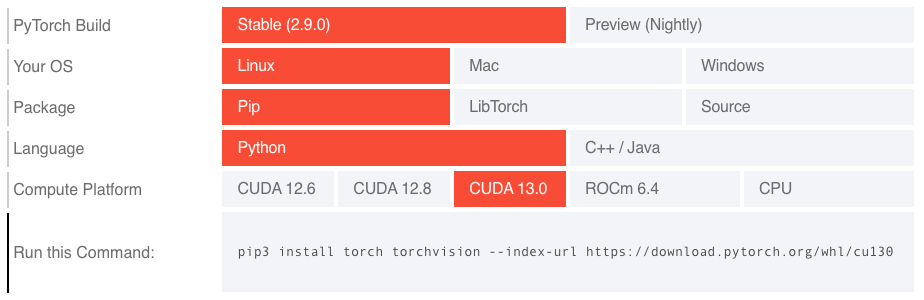

# PEP ### - Wheel Variants - extending platform awareness

| Resource             | Link                                                                                                                                     |
| -------------------- | ---------------------------------------------------------------------------------------------------------------------------------------- |
| `PEP Link`           | `To Be Published`                                                                                                                        |
| `DPO Discussion`     | [Implementation variants: rehashing and refocusing](https://discuss.python.org/t/implementation-variants-rehashing-and-refocusing/54884) |
| `Github Repository`  | <https://github.com/wheelnext/pep_xxx_wheel_variants>                                                                                    |
| `Demo / Wheel Index` | <https://wheelnext.github.io/variants-index/>                                                                                            |

## Abstract

The Python wheel packaging format uses
[platform compatibility tags](https://packaging.python.org/en/latest/specifications/platform-compatibility-tags/) to specify
wheel's supported environments based on Python version, ABI, and platform (operating system, architecture, core system
libraries). These tags are not able to express features of modern hardware. This is particularly challenging for the
scientific computing, artificial intelligence (AI), machine learning (ML), and high-performance computing communities,
where packages are often built with specific hardware accelerations (e.g., NVIDIA CUDA, AMD ROCm), specialized CPU
instructions (e.g., AVX512_BF16), or other system dependencies.

This PEP proposes "Wheel Variants," an extension to the
[binary distribution format specification](https://packaging.python.org/en/latest/specifications/binary-distribution-format/).
This extension introduces a
mechanism for package maintainers to declare multiple build variants for the same package version, while allowing installers to
automatically select the most appropriate variant based on system hardware and software capabilities and
characteristics. More specifically, it proposes:

- An evolution of the wheel format called **Wheel Variant** that allows wheels to be distinguished by hardware or
software attributes.

- A **variant provider plugin** interface allowing to dynamically detect platform attributes and select the most
suitable wheel.

The goal is to simplify the user experience to a familiar `pip install <package>`, while ensuring optimal
performance and compatibility.  This approach allows seamless package resolution without requiring intrusive changes to
installers, ensures backward compatibility, and minimizes the burden on package maintainers.

## Definitions

Most of the definitions are borrowed from [PEP 440](https://peps.python.org/pep-0440/#definitions)

The key words "MUST", "MUST NOT", "REQUIRED", "SHALL", "SHALL NOT", "SHOULD", "SHOULD NOT", "RECOMMENDED", "MAY", and
"OPTIONAL" in this document are to be interpreted as described in
[RFC 2119](https://datatracker.ietf.org/doc/html/rfc2119.html).

- **Projects** are software components that are made available for integration. Projects include Python libraries,
frameworks, scripts, plugins, applications, collections of data or other resources, and various combinations thereof.
Public Python projects are typically registered on the [Python Package Index](https://pypi.org/).

- **Releases** are uniquely identified snapshots of a project.

- **Distributions** are the packaged files which are used to publish and distribute a release.

- **Build tools** are automated tools intended to run on development systems, producing source and binary distribution
archives. Build tools may also be invoked by integration tools in order to build software distributed as sdists rather
than prebuilt binary archives.

- **Index servers** are active distribution registries which publish version and dependency metadata and place
constraints on the permitted metadata.

- **Publication tools** are automated tools intended to run on development systems and upload source and binary
distribution archives to index servers.

- **Installation tools** are integration tools specifically intended to run on deployment targets, consuming source and
binary distribution archives from an index server or other designated location and deploying them to the target system.

- **Automated tools** is a collective term covering build tools, index servers, publication tools, integration tools and
any other software that produces or consumes distribution version and dependency metadata.

## Motivation

The Python packaging ecosystem has evolved to support increasingly diverse computing environments. The current software
ecosystem often relies on platform specific features to pick which binaries are compatible with a particular computer.
Unfortunately the current wheel format cannot adequately express the features  of modern hardware. This limitation
forces package authors into suboptimal distribution strategies and creates friction for users attempting to install
performance-critical packages.

Existing approaches to handling Python packages with more complex platform requirements are suboptimal (explored below
in greater details). Some methods include maintaining separate package indexes for different hardware configurations,
bundling all potential variants into a single "mega-wheel" / "monolithic wheel" or using separate package names
(`mypackage-gpu`, `mypackage-cpu`). Each of these approaches has significant drawbacks, such as excessive binary size,
dependency confusion, and inefficient dependency resolution, complex documentation, etc.

According to the [2024 Python Developers Survey](https://lp.jetbrains.com/python-developers-survey-2024/#purposes-for-using-python),
a significant portion of respondents over the last years have been successively using Python for scientific computing
purposes, covering such areas as Data analysis (steadily over 40% respondents), Machine learning (grown to 40% in 2024),
Data engineering (around 30%), and more. Many of these use cases are directly impacted by suboptimal packaging.

This issue is often crossing the boundaries of scientific computing - as highlighted in the following issue:
[manylinux_2_34 x86-64 builds produce binaries that are not compatible with all x86-64 CPUs](https://github.com/pypa/manylinux/issues/1725),
where `manylinux_2_34_x86_64` now implicitly requires `x86_64-v2` with no support for other x86 version. This
lack of support results in complexity in managing platform-specific dependencies and compatibility. That complexity
affects the installation process for users and increases the maintenance burden for package authors. The `x86_64`
compiler flags further emphasizes the urgent need for a more expressive and efficient solution in the Python packaging
ecosystem.

As illustrated by [`archspec`](https://github.com/archspec/archspec)'s authors and maintainers, the ability to optimize
a package for a specific architecture can lead to significant performance improvement (and often also reduce power
requirements, etc.).


> "Compiling [GROMACS](https://www.gromacs.org/) for architectures that can exploit the AVX-512 instructions supported
> by the Intel Cascade Lake microarchitecture gives an additional 18% performance improvement relative to using AVX2
> instructions, with a speedup of about 70% compared to a generic GROMACS installation with only SSE2."
>
> Source: [archspec: A library for detecting, labeling, and reasoning about microarchitectures](https://tgamblin.github.io/pubs/archspec-canopie-hpc-2020.pdf)

This PEP proposes a systematic and scalable approach to selecting optimized wheels based on platform characteristics,
which will help Python’s usage expand across diverse computing environments, from cloud computing to embedded systems
and AI accelerators.

### User stories

- A user wants to install a version of NumPy that is specialized for their CPU architecture.

- A user wants to install a version of PyTorch that is specialized for their GPU architecture.

- A user wants to install a version of mpi4py that has certain features enabled
  (e.g. specific MPI implementations for their hardware).

- A library maintainer wants to build their library for wasm32-wasi with and without pthreads support.

- A library maintainer wants to build their library for an Emscripten platform for Pyodide with extensions for graphics
compiled in.

- A library maintainer wants to provide packages of their game library using different graphics backends.

- SciPy wants to provide packages built against different BLAS libraries, like OpenBLAS and Accelerate on macOS. This is
something they indirectly do today

### The limitations of platform compatibility tags

The current wheel format encodes compatibility through three platform tags:

- **Python tag:** [The Python tag indicates the implementation and version required by a distribution](https://packaging.python.org/en/latest/specifications/platform-compatibility-tags/#python-tag)
(e.g., `cp313`)
- **ABI tag:** [The ABI tag indicates which Python ABI is required by any included extension modules](https://packaging.python.org/en/latest/specifications/platform-compatibility-tags/#abi-tag)
(e.g., `cp313`, `none`)
- **Platform tag**: [Operating system and architecture - In its simplest form: sysconfig.get_platform()](https://packaging.python.org/en/latest/specifications/platform-compatibility-tags/#platform-tag)
(e.g., `linux_x86_64`)

While these tags effectively handle traditional compatibility dimensions, they cannot express modern requirements:

**GPU Accelerated Frameworks:** A wheel filename like `torch-2.9.0-cp313-cp313-manylinux_2_28_x86_64.whl`
provides no indication whether it contains NVIDIA CUDA support, AMD ROCm support, Intel XPU support, or is CPU-only.
Users cannot determine compatibility with their GPU hardware or drivers.

**CPU Instruction Sets:** A wheel filename like
`numpy-2.3.2-cp313-cp313-manylinux_2_27_x86_64.manylinux_2_28_x86_64.whl` provides no indication whether it contains
CPUs optimized instructions ranging from basic x86-64 to modern processors with AVX512, SHA-NI, and other specialized
instructions. Packages cannot indicate whether they require or benefit from specific CPU features. In turns having to
rely on the lowest common denominator forces to leave performance on the table.

**Runtime Dependencies:** Scientific computing packages often depend on specific BLAS implementations (OpenBLAS vs
Intel MKL), MPI providers (OpenMPI vs MPICH), or other system libraries that affect both functionality and performance.
The current Wheel format is not able to encode that dependency.

This lack of flexibility has led many projects to find sub-optimal - yet necessary - workarounds. Such as this manual
selector provided by the PyTorch team. This complexity represents a fundamental scalability issue with the current tag
system.



**Source:** [https://pytorch.org/get-started/locally/](https://pytorch.org/get-started/locally/) (screen capture date: 2025/08/22)

This problem is not unique to PyTorch. Projects like JAX, NumPy, SciPy, Scikit-Learn and many others in the scientific
Python ecosystem face similar hurdles. The core issue is that wheel tags, while successful, are not extensible enough
to handle the combinatorial complexity of build options.

### Current workarounds and their limitations

Package maintainers have developed various strategies to work around aforementioned limitations. However, each approach
has significant drawbacks.

These workarounds place a significant burden on both end-users and package maintainers. Users must understand their
hardware and software environment in detail to select the correct installation command. Maintainers must manage complex
build matrices and provide extensive documentation on how to install their packages correctly.

The Wheel Variants proposal aims to solve this problem at a fundamental level within the packaging ecosystem, providing
a standardized, automated, and user-friendly solution.

#### "Separate package indexes" as variants

Projects like [PyTorch](https://pytorch.org/get-started/locally/), [RAPIDS](https://docs.rapids.ai/install/#selector)
and other packages currently distribute packages that approximate "variants" through separate package indexes with
custom URLs.

```bash
pip install torch --index-url="https://download.pytorch.org/whl/cu129"
```

**This approach requires:**

- Manual selection of artifacts based on hardware and software factors
- Complex installation instructions
- Separate infrastructure maintenance
- Potential security issues when combining multiple indexes
- Managing and potentially hosting all project dependencies when using a single index which can significantly increase
storage and CDN cost
- Separate index for every combination of compatible features (e.g. GPU variants with different levels of CPU
optimizations)

**Induced Security Risk:** This approach has unfortunately led to supply chain attacks - More details on
[PyTorch Blog](https://pytorch.org/blog/compromised-nightly-dependency/).  It’s a non-trivial problem to address which
has forced the PyTorch to create a complete mirror of all their dependencies. Which is one of the core motivations
behind [PEP 766](https://peps.python.org/pep-0766/).

The complexity of configuration often leads to projects providing ad-hoc installation instructions rather than covering
permanent settings. This can lead to users being unable to cleanly upgrade the packages, or the upgraded packages being
reverted to the default variant on upgrades.

#### "Package name" as variants

Some packages use different names for variants (e.g.,
[`xgboost` - NVIDIA CUDA accelerated, `xgboost-cpu`](https://xgboost.readthedocs.io/en/stable/install.html)). However,
this creates dependency management challenges when multiple packages require the same underlying library with different
acceleration support.

Commonly, these packages install overlapping files. Since Python packaging does not support expressing that two packages
are mutually exclusive, installers can install both of them to the same environment, with the package installed second
overwriting files from the one installed first. This could lead to unpredictable behavior, including the possibility of
incidentally switching between variants depending on upgrade ordering.

Additional limitation of this approach is that publishing a new release synchronously across multiple package names is
not currently possible. [PEP 694](https://peps.python.org/pep-0694/) proposes adding such a mechanism for multiple
wheels within a single package, but extending it to multiple packages is not a goal.

**Induced Security Risk:** proliferation of suffixed variant packages leads users to expect these suffixes in other
packages, making name squatting much easier. For example, one could create a malicious `numpy-cuda` package that users
will be lead to believe it’s a CUDA variant of NumPy.

```bash
pip install xgboost      # NVIDIA GPU variant
pip install xgboost-cpu  # CPU-only variant
```

[cupy](https://github.com/cupy/cupy) for diverse reasons had to build a total of 52 different packages - all with
different names - which clearly highlights the limit of such an approach. End users need to carefully read the `CuPy`
installation documentation to figure out which package they need. And for maintainers it’s labor-intensive to
continuously have to create new PyPI packages, ask for limit increases, and keep their wheel build infrastructure and
documentation in sync with those new package names.

```bash
cupy-cuda100 cupy-cuda101 cupy-cuda102 cupy-cuda110 cupy-cuda111 cupy-cuda112 cupy-cuda113 cupy-cuda114 cupy-cuda115
cupy-cuda116 cupy-cuda117 cupy-cuda118 cupy-cuda119 cupy-cuda11x cupy-cuda120 cupy-cuda121 cupy-cuda122 cupy-cuda123
cupy-cuda124 cupy-cuda125 cupy-cuda126 cupy-cuda127 cupy-cuda128 cupy-cuda129 cupy-cuda12x cupy-cuda13x cupy-cuda70
cupy-cuda75 cupy-cuda80 cupy-cuda90 cupy-cuda91 cupy-cuda92 cupy-rocm-4-0 cupy-rocm-4-1 cupy-rocm-4-2 cupy-rocm-4-3
cupy-rocm-4-4 cupy-rocm-4-5 cupy-rocm-5-0 cupy-rocm-5-1 cupy-rocm-5-2 cupy-rocm-5-3 cupy-rocm-5-4 cupy-rocm-5-5
cupy-rocm-5-6 cupy-rocm-5-7 cupy-rocm-5-8 cupy-rocm-5-9 cupy-rocm-6-0 cupy-rocm-6-1 cupy-rocm-6-2 cupy-rocm-6-3
```

#### "Extra-Dependency" as variants

[JAX](https://docs.jax.dev/en/latest/installation.html) uses a plugin-based approach. The central `jax` package provides
a number of extras that can be used to install additional plugins, e.g. `jax[cuda12]` or `jax[tpu]`. This is far from
ideal as `pip install jax` (with no extra) would provide a broken install for everybody and consequently dependency
chains, a fundamental expected behavior in the Python ecosystem is dysfunctional.

JAX includes 12 extra selectors to cover all use cases - many of which overlap and could be misleading to users if they
don’t read in detail the documentation.

It should be noted that most of these "extras" are technically mutually exclusive, though it is currently impossible to
correctly express this incompatibility within the package metadata.

```yaml
Provides-Extra: minimum-jaxlib
Provides-Extra: cpu
Provides-Extra: ci
Provides-Extra: tpu
Provides-Extra: cuda
Provides-Extra: cuda12
Provides-Extra: cuda13
Provides-Extra: cuda12-local
Provides-Extra: cuda13-local
Provides-Extra: rocm
Provides-Extra: k8s
Provides-Extra: xprof
```

#### Bundled universal packages - monolithic builds

Including all possible variants in a single wheel is another option, but this leads to excessively large artifacts,
wasting bandwidth and slower installation times for users who only need one specific variant. In some cases, such
artifacts cannot be hosted on PyPI because they exceed its size limits.

#### Wheel variant selection via source distribution

[Flash-attention](https://github.com/Dao-AILab/flash-attention) does not publish wheels on PyPI at all, but instead
publishes a customized source distribution that performs platform detection, downloads the appropriate wheel from
upstream server, and then provides it to the installer. Such an approach can provide a good end-user experience by
selecting the most optimal variant automatically. However, it prevents `--only-binary` installs from working and
requires downloading source distribution and running its build phase. In this case, it also requires running with
`--no-build-isolation`. It requires hosting wheels separately, and does not provide for uniform experience across the
ecosystem.

**Induced Security Risk:** similarly to regular source builds, this model requires running arbitrary code at install
time.

#### Ecosystem fragmentation

The lack of standardized variant support has led to ecosystem fragmentation:

**Inconsistent User Experience**: Each package uses different installation methods, creating confusion and reducing
discoverability.

**Development Tool Complications**: Installation tools, IDEs, and CI/CD systems struggle to handle non-standard
installation requirements.

**Documentation Burden**: Maintainers must create and maintain complex installation guides and users must read them. If
they don’t know or don’t take the time to read it - almost certainly their install will be dysfunctional.

### Impact on scientific computing and AI/ML workflows

**TODO: Let’s insert as many quotes as possible from the community**

The packaging limitations particularly affect scientific computing and AI/ML applications where performance optimization
is critical.

#### Heterogeneous computing environments

Research institutions and cloud providers often manage heterogeneous computing clusters with different architectures
(CPU, Hardware accelerators, ASICS, etc.). The current system requires environment-specific installation procedures,
making reproducible deployment difficult. This situation also contributes to making "scientific papers" difficult to
reproduce.

#### Artificial intelligence, machine learning, and deep learning

The recent advances in modern AI workflows increasingly rely on GPU acceleration, but the current packaging system makes
deployment complex and adds a significant burden on open source developers of the entire tool stack (from build backends
to installers, not forgetting the package maintainers).

### Motivation summary

As highlighted in the previous section, the current Python packaging system cannot adequately serve the needs of modern
heterogeneous computing environments. These aforementioned limitations force package authors into complex workarounds
that create friction for users, increase maintenance burden, and fragment the ecosystem.

**Wheel Variants provide a standardized solution that:**

- Enables automatic hardware-appropriate package selection
- Maintains full backward compatibility with existing tools (by guaranteeing to not break non-variant aware installers,
tools, and indexes)
- Simplifies package maintenance by offering a unified and flexible solution to the challenge of managing multiple
platform-specific package builds and distributions.
- Provides a seamless and predictable experience for users, that requires little to no user inputs.
- Supports the full spectrum of modern computing hardware
- Provides a future-proof and flexible system that can evolve with the ecosystem and future use cases.

### Out-of-scope features

This PEP tries to present the minimal scope required and leaves aspects to tools to evolve. A non-exhaustive list:

- The format of the static variants file, and how to include them in a pylock.toml
- The list of variant providers that are vendored or re-implemented, as well as opt-in mechanisms
- How to instruct build backends to emit variants through the PEP 517 mechanism. For backwards compatibility, build
  backends have to default to non-variant builds

### Prior art

This problem is not unique to the Python ecosystem, different groups and ecosystems have come up with various answers to
that very problem. This section will focus on highlighting the strengths and weaknesses of the different approaches
taken by various communities.

#### Conda - conda-forge

[Conda](https://docs.conda.io) is a binary-only package ecosystem that uses aggregated metadata indexes for resolution
rather than filename parsing. Unlike the
[Simple Repository API](https://packaging.python.org/en/latest/specifications/simple-repository-api/#simple-repository-api),
conda's resolution relies on [repodata indexes per platform](https://docs.conda.io/projects/conda-build/en/stable/concepts/generating-index.html)
containing full metadata, making filenames purely identifiers with no parsing requirements.

**Variant System**: In [2016-2017](https://www.anaconda.com/blog/package-better-conda-build-3), conda-build introduced
variants to differentiate packages with identical name/version but different dependencies.

```bash
pytorch-2.8.0-cpu_mkl_py313_he1d8d61_100.conda      # CPU + MKL variant
pytorch-2.8.0-cuda128_mkl_py313_hf206996_300.conda  # CUDA 12.8 + MKL variant
pytorch-2.8.0-cuda129_mkl_py313_he100a2c_300.conda  # CUDA 12.9 + MKL variant
```

A hash (computed from variant metadata) prevents filename collisions; actual variant selection happens via standard
dependency constraints in the solver. No special metadata parsing is needed—installers simply resolve dependencies like:

```bash
conda install pytorch mkl
```

**Mutex Metapackages**: Python metadata and conda metadata do not have good ways to express ideas like "this package
conflicts with that one." The main mechanism for enforcement is sharing a common package name - only one package with a
given name can exist at one time. Mutex metapackages are sets of packages with the same name, but different build
string. Packages depend on specific mutex builds (e.g., `blas=*=openblas` vs `blas=*=mkl`) to avoid problems with related
packages using different dependency libraries, such as numpy using openblas and scipy using mkl.

**Example software variants**: [BLAS](https://conda-forge.org/docs/maintainer/knowledge_base/#blas),
[MPI](https://conda-forge.org/docs/maintainer/knowledge_base/#message-passing-interface-mpi),
[OpenMP](https://conda-forge.org/docs/maintainer/knowledge_base/#openmp),
[noarch vs native](https://conda-forge.org/blog/2024/10/15/python-noarch-variants/)

**Virtual Packages**: [Introduced in 2019](https://github.com/conda/conda/pull/8267), virtual packages inject system
detection (CUDA version, glibc, CPU features) as solver constraints. Built packages express dependencies like
`__cuda >=12.8`, and the installer verifies compatibility at install time. Current virtual packages include `archspec`
(CPU capabilities), OS/system libraries, and CUDA driver version. Detection logic is tool-specific
([rattler](https://github.com/conda/rattler/tree/main/crates/rattler_virtual_packages/src),
[mamba](https://github.com/mamba-org/mamba/blob/main/libmamba/src/core/virtual_packages.cpp)).

#### Spack / Archspec

[`archspec`](https://github.com/archspec/archspec) is a library for detecting, labeling, and reasoning about CPU
microarchitecture variants, developed from the [Spack](https://spack.io/) package manager.

**Variant Model:** CPU Microarchitectures (e.g., `haswell`, `skylake`, `zen2`, `armv8.1a`) form a
[Directed Acyclic Graph (DAG) encoding binary compatibility](https://tgamblin.github.io/pubs/archspec-canopie-hpc-2020.pdf),
which helps at resolve to express that `packageB` depends on `packageA`. The ordering is partial because (1) separate
ISA families are incomparable, and (2) contemporary designs may have incompatible feature sets—cascadelake and
cannonlake are incomparable despite both descending from skylake, as each has unique AVX-512 extensions.

**Implementation:** A language-agnostic JSON database stores microarchitecture metadata (features, compatibility
relationships, compiler-specific optimization flags). Language bindings provide detection (queries /proc/cpuinfo,
matches to microarchitecture with largest compatible feature subset) and compatibility comparison operators.

**Package Manager Integration:** Spack records target microarchitecture as package provenance
(`spack install fftw target=broadwell`), automatically selects compiler flags, and enables microarchitecture-aware
binary caching. The [European Environment for Scientific Software Installations (EESSI)](https://onlinelibrary.wiley.com/doi/full/10.1002/spe.3075)
distributes optimized builds in separate subdirectories per microarchitecture (e.g., `x86_64`/``armv8.1a`/`haswell`);
runtime initialization uses `archspec` to select best compatible build when no exact match exists.

#### Gentoo Linux

[Gentoo Linux](https://www.gentoo.org) is a source-first distribution with support for extensive package customization.
This is primarily achieved via [USE flags](https://devmanual.gentoo.org/general-concepts/use-flags/index.html): boolean
flags exposed by individual packages and permitting fine-tuning the enabled features, optional dependencies and some
build parameters (e.g. `jpegxl`, `cpu_flags_x86_avx2`). Flags can be toggled individually, and separate binary packages
can be built for different sets of flags. The package manager can either pick a binary package with matching
configuration or build from source.

API and ABI matching is primarily done through use of [slotting](https://devmanual.gentoo.org/general-concepts/slotting/index.html).
Slots are generally used to provide multiple versions or variants of given package that can be installed alongside
(e.g. different major GTK+ or LLVM versions, or GTK+3 and GTK4 builds of WebKitGTK), whereas subslots are merely used
to group versions within a slot, usually corresponding to the library SOVERSION. Packages can then declare dependencies
bound to the slot and subslot used at build time. Again, separate binary packages can be built bound to different
dependency slots, and when installing a dependency version falling into a different slot or subslot, the package manager
may either choose a binary packages bound to that slot or rebuild from source.

Normally, the use of slots assumes that upgrading to the newest version possible is desirable. When more fine-grained
control is desired, slots are used in conjunction with USE flags. For example, `llvm_slot_${major}` flags are used
to select a LLVM major version to build against.

## Rationale

### Modified wheel filename

A variant label component is added to the filename for the twofold purpose of providing a unique mapping from the
filename to a set of variant properties, and providing a human-readable identification for the variant. The label
is kept short and lowercase to avoid issues with different filesystems. It is added as a `-`-separated component
at the end to ensure that the existing filename validation algorithms reject it:

- If both the build tag and the variant label are present, the filename contains too many components.

  Example: `numpy-2.3.2-1-cp313-cp313t-musllinux_1_2_x86_64-x86_64_v3.whl`

- If only the variant label is present, the Python tag at third position will be misinterpreted as a build number.
  Since the build number must start with a digit and no Python tags at the time start with digits, the filename is
  considered invalid.

  Example: `numpy-2.3.2-cp313-cp313t-musllinux_1_2_x86_64-x86_64_v3.whl`

This behavior was confirmed for a number of existing tools: [auditwheel](https://github.com/pypa/auditwheel/blob/6839107e9b918e035ab2df4927a25a5f81f1b8b6/src/auditwheel/repair.py#L61-L64),
[packaging](https://github.com/pypa/packaging/blob/78c2a5e4f5c04fd782a5729d93892c3a3eafe365/src/packaging/utils.py#L94-L134),
[pdm](https://github.com/pdm-project/pdm/blob/main/src/pdm/models/requirements.py#L260-L287),
[pip](https://github.com/pypa/pip/blob/c46141c29c3646a3328bc4e51d354cc732fb1432/src/pip/_internal/models/wheel.py#L38-L46),
[poetry](https://github.com/python-poetry/poetry/blob/1c04c65149776ae4993fa508bef53373f45c66eb/src/poetry/utils/wheel.py#L23-L27),
[uv](https://github.com/astral-sh/uv/blob/f6a9b55eb73be4f1fb9831362a192cdd8312ab96/crates/uv-distribution-filename/src/wheel.rs#L182-L299),
[warehouse](https://github.com/pypi/warehouse/blob/main/warehouse/utils/wheel.py#L78-L81).

### Example use cases

#### PyTorch CPU/GPU variants

As of October 2025, [PyTorch](https://pytorch.org/get-started/locally/) publishes builds a total of seven variants
for every release: a CPU-only variant, three CUDA variants with different minimal CUDA runtime versions and supported
GPUs, two ROCm variants and a Linux XPU variant.

This setup could be improved using two GPU plugins that query the installed runtime version and installed GPUs to filter
out the wheels for which the runtime is unavailable, it is too old or the user's GPU is not supported, and order
the remaining variants by the runtime version. The CPU-only version is published as a null variant that is always
supported.

If a GPU runtime is available and supported, the installer automatically chooses the wheel for the newest runtime
supported. Otherwise, it falls back to the CPU-only variant. In the corner case when both CUDA and ROCm are available
and supported, PyTorch package maintainers indicate which one takes preference by default.

#### Optimized CPU variants

Wheel variants can be used to provide variants requiring specific CPU extensions, beyond what platform tags currently
provide. They can be particularly helpful when runtime dispatching is impractical, when the package relies on prebuilt
components that use instructions above the baseline or when availability of instruction sets implies library ABI
changes.

For example, an x86-64 CPU plugin can detect the capabilities for the installed CPU, mapping them onto the appropriate
x86-64 architecture level and a set of extended instruction sets. Variant wheels indicate which level and/or instruction
sets are required, filter out variants that do not meet the requirements and select the best optimized variant.
A non-variant wheel can be used to represent the architecture baseline, if supported.

Implementation using wheel variants makes it possible to provide fine-grained indication of instruction sets required,
with plugins that can be updated as frequently as necessary. In particular, it is neither necessary to cover all
available instruction sets from the start, nor to update the installers whenever the instruction set coverage needs
to be improved.

#### BLAS / LAPACK variants

Packages such as [NumPy](https://numpy.org/) and [SciPy](https://scipy.org/) can be built using different BLAS / LAPACK
libraries. Users may wish to choose a specific library for improved performance on a particular hardware or license
considerations. Furthermore, different libraries may use different OpenMP implementations, whereas using a consistent
implementation across the stack can avoid performance degradation by spawning too many threads.

BLAS / LAPACK variants do not require a plugin at install time, since all variants built for a particular platform
are compatible with it. Therefore, an ahead-of-time provider (with `install-time = false`) that provides a predefined
set of BLAS / LAPACK library names can be used. When the package is installed, normally the default variant is used,
but the user can explicitly select another one.

#### Debug package variants

A package may wish to provide a special debug-enabled builds for debugging or CI purposes, in addition to the regular
release build. For this purpose, an optional ahead-of-time provider can be used (`install-time = false` with
`optional = true`), defining a custom property for the debug builds. Since the provider is disabled by default, users
normally install the non-variant wheel providing the release build. However, they can easily obtain the debug build
by enabling the optional provider or selecting the variant explicitly.

#### Package ABI matching

Packages such as [vLLM](https://docs.vllm.ai/en/latest/index.html) need to be pinned to the PyTorch version they were
built against to preserve ABI compatibility. This often results in unnecessarily strict pins in package versions, making
it impossible to find a satisfactory resolution for an environment involving multiple packages requiring different
versions of PyTorch. Variant wheels can be used to publish variants of vLLM built against different PyTorch version,
therefore enabling upstream to easily provide support for multiple versions simultaneously.

TODO: fill in when https://github.com/wheelnext/pep_xxx_wheel_variants/issues/87 concludes

## Specification

This PEP proposes a set of backward-compatible extensions to the wheel format (PEP [427](https://peps.python.org/pep-0427/)
& [491](https://peps.python.org/pep-0491/)) and the packaging ecosystem version while maintaining complete backward
compatibility with existing package managers and tools. The design was made with the intent to protect
non-variant-aware tools from failure when a new type of wheel appears that they don’t know how to manage.

### Wheel variant glossary

This section focuses specifically on the vocabulary used by the proposed "Wheel Variant" standard:

- **Variant Wheels**: Wheels that share the same distribution name, version, build number, and platform compatibility
tags, but are distinctly identified by an arbitrary set of variant properties.

- **Variant Namespace**: An identifier used to group related features provided by a single plugin (e.g., `nvidia`,
`x86_64`, `arm`, etc.).

- **Variant Feature**: A specific characteristic (key) within a namespace (e.g., `version`, `avx512_bf16`, etc.) that
can have one or more values.

- **Variant Property**: A 3-tuple (`namespace :: feature-name :: feature-value`) describing a single specific feature
and its value. If a feature has multiple values, each is represented by a separate property.

- **Variant Label**: A string added to the wheel filename to uniquely identify variants. A string up to 16 characters.

- **Null Variant**: A special variant with zero variant properties and the reserved label `null`. Always considered
supported but has the lowest priority among wheel variants, while being preferably chosen over non-variant wheels.

- **Variant Provider**: A provider of supported and valid variant properties for a specific namespace, usually
in the form of a Python package that implements system detection.

- **Install-time Provider**: A provider implemented as a plugin that can be queried during wheel installation.

- **Ahead-of-Time Provider**: A provider that features a static list of supported properties which is then embedded
in the wheel metadata. Such a list can either be embedded in `pyproject.toml` or provided by a plugin queried at build
time.

### Overview

Wheel variants introduce a more fine-grained specification of built wheel characteristics beyond what wheel tags
provide. Individual wheels are characterized by sets of variant properties that are organized into a hierarchical
structure of namespaces, features and feature values.
When evaluating wheels to install, the installer must determine whether variant properties are compatible with
the system in addition to determining the tag compatibility. To choose the most suitable wheel to install, the
installer must order wheels according to the priorities of their variant properties first, and their tags second.

Every variant namespace is governed by a variant provider. There are two kinds of variant providers: install-time
providers and ahead-of-time (AoT) providers. Install-time providers require plugins that are queried while installing
wheels to determine the set of supported properties and their preference order. For AoT providers, this data is static
and embedded in the wheel; it can be either provided directly by the developer or queried at wheel build time from
an AoT plugin. Both kinds of plugins are usually implemented as third-party Python packages providing the API specified
in this document.

Package managers must not install or run any untrusted package for variant resolution without the explicit user opt-in.
Provider packages should take measures to guard against supply chain attacks, for example by vendoring all dependencies.
Pinning dependencies is discouraged to comply with PEP 517 build process, as provider plugins may be needed at build
time and dependencies pinned to different versions could prevent different plugins from being installed simultaneously
in the same environment.

It is recommended that the most commonly used plugins are either vendored, reimplemented, or locked to specific
wheels after verifying their trustworthiness, to enable the ability to securely install variant wheels out-of-the-box.
To reduce the maintenance costs, repositories of such vetted plugins could be maintained collaboratively and shared
between different package managers.

For plugins not in such a pre-approved list, a trust-on-first-use mechanism for every version is recommended. In
interactive sessions, the package manager can explicitly ask the user for approval. In non-interactive sessions, the
approval can be given using command-line interface options. It is important that the user is informed of the risk before
giving such an approval.

For a consistent experience between tools, variant wheels should be supported by default. Tools may provide an opt-out
to only use non-variant wheels. For scenarios requiring more control, providers can be marked as optional and must be
explicitly enabled by the user.

### Overview of changes

The Wheel Variant PEP introduces four key components:

1. **Extended Wheel Filenames**: Variant wheels include a variant label in their filename to ensure:
    1. that every distinct variant has a unique filename
    2. that variant wheels are not accidentally installed by non-variant-aware tools.

2. **Variant Metadata Format**: Standardized metadata describing variant properties and provider requirements.
    1. Metadata specification at "project level" inside `pyproject.toml`
    2. Metadata specification of "built packages" inside two JSON files:
        1. `*.dist-info/variant.json`: Individual wheel variant metadata.
        2. `*-variants.json`: Variant metadata file aggregated on the package index.

3. **Provider Plugin System**: Plugin interface to allow detection of system capabilities and validate variant
compatibility.

4. **Environment Markers**: New environment markers to declare dependencies that are applicable to a subset of variants only.

### Extended wheel filename

This PEP changes the wheel filename template originally defined
by [PEP 427](https://peps.python.org/pep-0427/#file-name-convention) to:

```re
{distribution}-{version}(-{build tag})?-{python tag}-{abi tag}-{platform tag}(-{variant label})?.whl
```

Wheels using extensions introduced by this PEP must feature the variant label component. It must match the following
regular expression: `^[0-9a-z._]{1,16}$` (ASCII, case-sensitive). Every label must uniquely correspond to a specific
set of variant properties, same for all wheels using the same label within a single package version. Variant labels
should be specified at wheel build time, as human-readable strings. The label `null` is reserved for the null variant.

Installers that do not implement this specification must ignore wheels with variant label present, and fall back
to a wheel without such label if it is available.

Examples:

- Non-variant wheel:           `numpy-2.3.2-cp313-cp313t-musllinux_1_2_x86_64.whl`
- Wheel with variant label:    `numpy-2.3.2-cp313-cp313t-musllinux_1_2_x86_64-x86_64_v3.whl`

### Null variant

The concept of a null variant makes it possible to distinguish a fallback wheel variant from a regular wheel
published for backwards compatibility. For example, a package that features optional GPU support could publish the
following wheels:

- One or more wheel variants built for specific hardware for wheel variant enabled systems with
suitable hardware.

- A CPU-only null variant for systems with wheel variant support but without suitable hardware.

- A GPU+CPU regular wheel for systems without wheel variant support (i.e. the “mega-wheel” approach)

The null variant must not have any properties and it must use the variant label `null`.
Conversely, wheel variants that declare any variant properties must not use the variant label `null`.

In particular, this makes it possible to publish a smaller null variant for systems that do not feature suitable
hardware, with a fallback regular wheel with support for CPU and all GPUs for systems where variants are not supported
and therefore GPU support cannot be determined.

Not being compatible with any of the available variants gives the installer more information about the system
(e.g. not having specialized hardware) than systems which do not support wheel variants. Consequently, it makes sense
that package maintainers may wish to propose a different “fallback” to their users whether their system is Wheel Variant
enabled or not. Publishing a null variant is optional. If one is published, a wheel variant enabled
installer must select in priority the null variant. If none is published, fallback on the non-variant wheel instead.
The non-variant wheel is also used if variant support is explicitly disabled by an installer flag.

### Variant properties system

Variant properties follow a key-value design, where namespace and feature name constitute the key. Namespaces are used
to group features defined by a single provider, and avoid conflicts should multiple providers define a feature with the
same name. These keys are restricted to lowercase letters, digits and underscores, to make it easier to preserve
consistency between different providers. In particular, uppercase characters are disallowed to avoid different spellings
of the same name. The character set for values is more relaxed, to permit values resembling versions.

Variant features can be declared as allowing multiple values. If that is the case, these values are matched as a logical
disjunction, i.e. only a single value needs to be supported. Features are treated conjunctively, i.e. all of them need
to be supported. This provides some flexibility in designating variant compatibility while avoiding having to implement
a complete boolean logic.

**This hierarchical structure enables:**

- Organized property management without naming conflicts
- Independent development of provider plugins
- Extensible support for new hardware and software capabilities without requiring changes to tools or a new PEP
- Clear ownership and validation responsibilities

#### Variant property format

Variant properties use a structured 3-tuple format inspired by [PEP 301 for Trove Classifiers](https://peps.python.org/pep-0301/#distutils-trove-classification)

```
namespace :: feature-name :: feature-value
```

Examples:

```
nvidia :: cuda_version_lower_bound :: 12.8
x86_64 :: level :: v3
aarch64 :: version :: 8.1a
x86_64 :: avx512_bf16 :: on
```

#### Variant property validation

**Variant Namespace:** identifies the provider and must be unique within the provider set used by a single package
version.

- It **must** match this regex: `^[a-z0-9_]+$`

**Variant Feature Name**: Names a specific “characteristic” within the namespace.

- It **must** match this regex: `^[a-z0-9_]+$`

**Variant Feature Value**: A single value corresponding to the combination `namespace :: feature`.

- It **must** match this regex: `^[a-z0-9_.]+$`
- In a “multi-value” feature, a single variant wheel can specify multiple values corresponding to a single feature key.
Otherwise, only a single value can be present.

#### Variant ordering

To determine which variant wheel to install when multiple wheels are compatible, variant wheels are ordered by their
variant properties.

The order of variant properties is defined first by the order of namespaces, then the order of features in the namespace
and then the order of property values in a feature.

The order of namespaces is defined by `default-priorities.namespace`. The order of features in a namespace is initially
defined by `default-priorities.feature`. Features not listed in `default-priorities.feature` are appended in the order
they are returned by the variant provider plugin. Similarly, the order of property values in a feature is defined by
their order in `default-priorities.property`, with missing properties appended in order from the variant provider
output. In each list, earlier elements have higher priority than later elements.

A variant wheel has a higher priority than another variant wheel if its highest priority property is of higher priority
than the highest priority property of the other variant wheel. If both wheels have the same highest priority property,
compare the second highest priority property, and so on, until a tie-breaker is found. If the same set of highest priority
properties is shared by both wheels, the wheel having additional properties has higher priority.

A different way to describe the same algorithm:

Use the index in `default-priorities.namespace` to assign each namespace a priority score. For each namespace, build a
feature priority list by concatenating its `default-priorities.feature` features with its features in the provider
output not in `default-priorities.feature`, and for each feature, build a property value priority list by concatenating
its `default-priorities.property` properties with its properties in the provider output not in
`default-priorities.property`. Use the index in those lists to assign a priority score to every namespace, feature and
property, earlier entries get a higher score than later entries. This defines a function to assign each property used in
a variant wheel a score, which is the three-tuple of namespace, feature name and feature value score.

For each wheel, translate their properties into a list of scores, and sort that list, higher scores first. This assigns
each wheel a score that is a sorted list of three-tuples. Order the wheels by their scores. The variant wheel with the
highest score is the most preferred wheel.

### Variant metadata

This section describes the metadata format for the providers, variants and properties of a package and its wheels. The
format is used in three locations, with slight variations:

- in the source tree, inside the `pyproject.toml` file
- in the built wheel, as a `*.dist-info/variant.json` file
- on the package index, as a `{name}-{version}-variants.json` file.

All three variants metadata files share a common JSON-compatible structure:

```txt
(root)
|
+- providers
|  +- <namespace>
|     +- enable-if     : str | None
|     +- install-time  : bool = True
|     +- optional      : bool = False
|     +- plugin-api    : str | None
|     +- requires      : list[str]
|
+- default-priorities
|  +- namespace        : list[str]
|  +- feature
|     +- <namespace>   : list[str]
|  +- property
|     +- <namespace>
|        +- <feature>  : list[str]
|
+- static-properties
|  +- <namespace>
|     +- <feature>     : list[str]
|
+- variants
   +- <variant-label>
      +- <namespace>
         +- <feature>  : list[str]
```

[A JSON Schema is included in the Appendix of this PEP. TODO: Move to appendix](../assets/wheel_variants/variant_schema.json)

#### Provider information

`providers` is a dictionary, the keys are namespaces, the values are dictionaries with provider information. It
specifies how to install and use variant providers. A provider information dictionary must be declared in
`pyproject.toml` for every supported variant namespace. It must be copied to `variant.json` as-is, including data for
providers that are not used in the particular wheel.

A provider information dictionary can contain the following keys:

- `enable-if: str`: An environment marker defining when the plugin should be used. If the environment marker
  does not match the running environment, the provider will be disabled and the variants using its properties
  will be deemed incompatible. If not provided, the plugin will be used in all environments.

- `install-time: bool`: Whether this is an install-time provider. Defaults to `true`. `false` means that it is
  an AoT provider instead.

- `optional: bool`: Whether the provider is optional, as a boolean value. Defaults to `false`. If it is true, the provider
  is considered optional and should not be used unless the user opts in to it, effectively rendering the variants
  using its properties incompatible. If it is false or missing, the provider is considered obligatory.

- `plugin-api: str`: The API endpoint for the plugin. If it is specified, it must be an object reference
  as explained in the "API endpoint" section. If it is missing, the package name from the first dependency specifier
  in `requires` is used, after replacing all `-` characters with `_` in the normalized package name.

- `requires: list[str]`: A list of one or more package dependency specifiers. When installing the provider,
  all the items are processed (provided their environment markers match), but they must always resolve
  to a single distribution to be installed. Multiple dependencies can be used when different plugins providing
  the same namespace need to be used conditionally to environment markers, e.g. for different Python versions
  or platforms.

For install-time providers (i.e. when `install-time` is true), the `requires` key is obligatory. For AoT providers
(i.e. otherwise), the `requires` key is optional. If it specified, it needs to specify an AoT provider plugin that
is queried at build time to fill `static-properties`. If it is not specified, `static-properties` need to be specified
in `pyproject.toml`.

#### Default priorities

The `default-priorities` dictionary controls the ordering of variants.

It has a single required key:

- `namespace: list[str]`: All namespaces used by the wheel variants, ordered in decreasing priority.
   This list must have the same members as the keys of the `providers` dictionary.

It may have the following optional keys:

- `feature: dict[str, list[str]]`: A dictionary with namespaces as keys, and ordered list of corresponding feature names
  as values. The values in each list override the default ordering from the provider output. They are listed
  from the highest priority to the lowest priority. Features not present on the list are considered of lower priority
  than those present, and their relative priority is defined by the plugin.

- `property: dict[str, dict[str, list[str]]]`: A nested dictionary with namespaces as first-level keys, feature names as
  second-level keys and ordered lists of corresponding property values as second-level values. The values present in the
  list override the default ordering from the provider output. They are listed from the the highest priority to the
  lowest priority. Properties not present on the list are considered of lower priority than these present, and their
  relative priority is defined by the plugin output.

#### Static properties

The `static-properties` dictionary specifies the supported properties for AoT providers. It is a nested dictionary
with namespaces as first level keys, feature name as second level keys and ordered lists of feature values as second
level values.

In `pyproject.toml` file, the namespaces present in this dictionary in `pyproject.toml` file must correspond to all AoT
providers without a plugin (i.e. with `install-time` of `false` and no `requires`). When building a wheel, the build
backend must query the AoT provider plugins (i.e. these with `install-time` being false and non-empty `requires`)
to obtain supported properties and embed them into the dictionary. Therefore, the dictionary in `variant.json`
and `*-variants.json` must contain namespaces for all AoT providers (i.e. all providers with `install-time` being
false).

Since TOML and JSON dictionaries are unsorted, so are the features in the `static-properties` dictionary.
If more than one feature is specified for a namespace,
then the order for all features must be specified in `default-priorities.feature.{namespace}`. If an AoT plugin is used
to fill `static-properties`, then the features not already in the list in `pyproject.toml` must be appended to it.

The list of values is ordered from the most preferred to the least preferred, same as the lists returned
by `get_supported_configs()` plugin API call. The `default-priorities.property` dict can be used to override
the property ordering.

#### Variants

The `variants` dictionary is used in `variant.json` to indicate the variant that the wheel was built for,
and in `*-variants.json` to indicate all the wheel variants available. It's a 3-level dictionary listing all properties
per variant label: The first level keys are variant labels, the second level keys are namespaces, the third level are
feature names, and the third level values are lists of feature values.

#### `pyproject.toml`: variant project-level data table

The `pyproject.toml` file is the standard project configuration file as defined in
[pyproject.toml specification](https://packaging.python.org/en/latest/specifications/pyproject-toml/#pyproject-toml-spec).
The variant metadata is rooted at the top-level variant table. This format does not include the variant dictionary.

Under a `[variant]` key, it defines the providers and default priorities needed to build and consume the variants.

**Example Structure:**

```toml
[variant.default-priorities]
# prefer CPU features over BLAS/LAPACK variants
namespace = ["x86_64", "aarch64", "blas_lapack"]

# prefer aarch64 version and x86_64 level features over other features
# (specific CPU extensions like "sse4.1")
feature.aarch64 = ["version"]
feature.x86_64 = ["level"]

# prefer x86-64-v3 and then older (even if CPU is newer)
property.x86_64.level = ["v3", "v2", "v1"]

[variant.providers.aarch64]
# example using different package based on Python version
requires = [
    "provider-variant-aarch64 >=0.0.1; python_version >= '3.12'",
    "legacy-provider-variant-aarch64 >=0.0.1; python_version < '3.12'",
]
# use only on aarch64/arm machines
enable-if = "platform_machine == 'aarch64' or 'arm' in platform_machine"
plugin-api = "provider_variant_aarch64.plugin:AArch64Plugin"

[variant.providers.x86_64]
requires = ["provider-variant-x86-64 >=0.0.1"]
# use only on x86_64 machines
enable-if = "platform_machine == 'x86_64' or platform_machine == 'AMD64'"
plugin-api = "provider_variant_x86_64.plugin:X8664Plugin"

[variant.providers.blas_lapack]
# plugin-api inferred from requires
requires = ["blas-lapack-variant-provider"]
# plugin used only when building package, properties will be inlined
# into variant.json
install-time = false
```

#### `*.dist-info/variant.json`: the packaged variant metadata file

The `variant.json` file is placed inside variant wheels, in the `*.dist-info/` directory containing the wheel metadata.
It is serialized into JSON, with a variant metadata dictionary being the top object. In addition to the shared metadata
imported from `pyproject.toml`, it contains a `variants` object that must list exactly one variant - the variant
provided by the wheel.

The `$schema` URL must correspond to the schema file supplied in the appendix of this PEP. The URL contains the version
of the format, and a new version must be added to the appendix whenever the format changes in the future.

**The variant.json file corresponding to the wheel built from the example pyproject.toml file for x86-64-v3 would look like:**

```jsonc
{
   // TODO: replace this with appendix URL for the PEP
   "$schema": "https://variants-schema.wheelnext.dev/v0.0.3.json",
   "default-priorities": {
      "feature": {
         "aarch64": ["version"],
         "x86_64": ["level"]
      },
      "namespace": ["x86_64", "aarch64", "blas_lapack"],
      "property": {
         "x86_64": {
            "level": ["v3", "v2", "v1"]
         }
      }
   },
   "providers": {
      "aarch64": {
         "enable-if": "platform_machine == 'aarch64' or 'arm' in platform_machine",
         "plugin-api": "provider_variant_aarch64.plugin:AArch64Plugin",
         "requires": [
            "provider-variant-aarch64 >=0.0.1; python_version >= '3.9'",
            "legacy-provider-variant-aarch64 >=0.0.1; python_version < '3.9'"
         ]
      },
      "blas_lapack": {
         "install-time": false,
         "requires": ["blas-lapack-variant-provider"]
      },
      "x86_64": {
         "enable-if": "platform_machine == 'x86_64' or platform_machine == 'AMD64'",
         "plugin-api": "provider_variant_x86_64.plugin:X8664Plugin",
         "requires": ["provider-variant-x86-64 >=0.0.1"]
      }
   },
   "static-properties": {
      "blas_lapack": {
         "provider": ["accelerate", "openblas", "mkl"]
      },
   },
   "variants": {
      // always a single entry, expressing the variant properties of the wheel
      "x8664v3_openblas": {
         "blas_lapack": {
            "provider": ["openblas"]
         },
         "x86_64": {
            "level": ["v3"]
         }
      }
   }
}
```

#### `{name}-{version}-variants.json`: the index level variant metadata file.

For every package version that includes at least one variant wheel, there must exist a corresponding
`{name}-{version}-variants.json` file, hosted and served by the package index, where the package name and version are
normalized according to the same rules as wheel files, as found in the
[Binary Distribution Format specification](https://packaging.python.org/en/latest/specifications/binary-distribution-format/#escaping-and-unicode).
The link to this file must be present on all index pages where the variant wheels are linked.

This file uses the same structure as `variant.json` described above, except that the variants object must list all
variants available on the package index for the package version in question. It is recommended that tools enforce
the same contents of the `default-priorities`, `providers` and `static-properties` sections for all variants listed
in the file, though careful merging is possible, as long as no conflicting information is introduced, and the resolution
results within a subset of variants do not change.

**The following behaviors must be respected and verified during the generation of the `{name}-{version}-variants.json` file:**

- Wheel Variants must declare strictly identical `default-priorities` and `providers` dictionary entries.
- Wheel Variants with different labels must not use strictly identical sets of variant properties
- Wheel Variants with identical labels must use strictly identical sets of variant properties

The `foo-1.2.3-variants.json` corresponding to the package with two wheel variants, one of them listed in the
previous example, would look like:

```jsonc
{
   // TODO: replace this with appendix URL for the PEP
   "$schema": "https://variants-schema.wheelnext.dev/v0.0.3.json",
   "default-priorities": {
      // identical to above
   },
   "providers": {
      // identical to above
   },
   "static-properties": {
      // identical to above
   },
   "variants": {
      // all available wheel variants
      "x8664v3_openblas": {
         "blas_lapack": {
            "provider": ["openblas"]
         },
         "x86_64": {
            "level": ["v3"]
         }
      },
      "x8664v4_mkl": {
         "blas_lapack": {
            "provider": ["mkl"]
         },
         "x86_64": {
            "level": ["v4"]
         }
      }
  }
}
```

### Integration with `pylock.toml`

The following section is added to the `pylock.toml` specification:

```rst
.. _pylock-packages-variants-json:

``[packages.variants-json]``
----------------------------

- **Type**: table
- **Required?**: no; requires that :ref:`pylock-packages-wheels` is used,
  mutually-exclusive with :ref:`pylock-packages-vcs`,
  :ref:`pylock-packages-directory`, and :ref:`pylock-packages-archive`.
- **Inspiration**: uv_
- The URL or path to the `variants.json` file.
- Only used if the project uses :ref:`wheel variants <wheel-variants>`.

.. _pylock-packages-variants-json-url:

``packages.variants-json.url``
''''''''''''''''''''''''''''''

See :ref:`pylock-packages-archive-url`.

.. _pylock-packages-variants-json-path:

``packages.variants-json.path``
'''''''''''''''''''''''''''''''

See :ref:`pylock-packages-archive-path`.

.. _pylock-packages-variants-json-hashes:

``packages.variants-json.hashes``
'''''''''''''''''''''''''''''''''
```

If there is a `[packages.variants-json]` section, the installer should resolve
variants to select the best wheel file.

### Provider plugin API

#### High level design

Every provider plugin must operate within a single namespace. This namespace is used as a unique key for all
plugin-related operations. All the properties defined by the plugin are bound within the plugin's namespace, and the
plugin defines all the valid feature names and values within that namespace.

It is recommended that providers choose namespaces that can be clearly associated with the project they represent, and
avoid namespaces that refer to other projects or generic terms that could lead to naming conflicts in the future.

Within a single package and for a specific release version, only one plugin can be used for a given namespace.
Attempting to load more than one plugin for the same namespace in the same release version must result in a fatal error.
While multiple plugins for the same namespace may exist across different packages or release versions (such as when a
plugin is forked due to being unmaintained), they are mutually exclusive within any single release version.

To make it easier to discover and install plugins, they should be published in the same indexes that the packages using
them. In particular, packages published to PyPI must not rely on plugins that need to be installed from other indexes.

Plugins are implemented as Python packages. They need to expose two kinds of Python objects at a specified API endpoint:
attributes that return a specific value after being accessed via `{API endpoint}.{attribute name}`, and callables that
are called via `{API endpoint}.{callable name}({arguments}...)`. These can be implemented either as modules, or classes
with class methods or static methods.

#### API endpoint

The location of the plugin code is called an "API endpoint", and it is expressed using the object reference notation
following the [entry point specification](https://packaging.python.org/en/latest/specifications/entry-points/).
They are in the form of:

```python
{import path}(:{object path})?
```

An API endpoint specification is equivalent to the following Python pseudocode:

```python
import inspect
import {import path}

if "{object path}":
    plugin = {import path}.{object path}
else:
    plugin = {import path}
```

API endpoints are used in two contexts:

a. in the `plugin-api` key of variant metadata, either explicitly or inferred from the package name in the `requires`
   key. This is the primary method of using the plugin when building and installing wheels.

b. as the value of an installed entry point in the `variant_plugins`. The name of said entry point is insignificant.
   This is optional but recommended, as it permits variant-related utilities to discover variant plugins installed
   to the user's environment.

#### Behavior stability and versioning

It is recommended that the plugin’s output remains stable within the plugin’s lifetime, and that packages do not pin to
specific plugin versions. This ensures that the installer can vendor or reimplement the newest version of the plugin
while ensuring that variant wheels created earlier would still be installable.

If a need arises to introduce a breaking change in the plugin's output, it is recommended to add a new API endpoint to
the plugin. The old endpoints should continue being provided, preserving the previous output.

#### Helper classes

##### Variant feature config

The variant feature config class is used to define a single variant feature, along with a list of possible values.
Depending on the context, the order of values may be significant. It is defined using the following protocol:

```python
from abc import abstractmethod
from typing import Protocol
from typing import runtime_checkable


@runtime_checkable
class VariantFeatureConfigType(Protocol):
    """A protocol for VariantFeature configs"""

    @property
    @abstractmethod
    def name(self) -> str:
        """Feature name"""
        raise NotImplementedError

    @property
    @abstractmethod
    def multi_value(self) -> bool:
        """Does this property allow multiple values per variant?"""
        raise NotImplementedError

    @property
    @abstractmethod
    def values(self) -> list[str]:
        """Ordered list of values, most preferred first"""
        raise NotImplementedError
```

A "variant feature config" must provide three properties or attributes:

- `name` specifying the feature name, as a string.

- `multi_value` specifying whether the feature is allowed to have multiple corresponding values within a single variant
wheel. If it is `False`, then it is an error to specify multiple values for the feature.

- `values` specifying feature values, as a list of strings. In contexts where the order is significant, the values must
be orderred from the most preferred to the least preferred.

All features are interpreted as being within the plugin's namespace.

#### Plugin class

##### Protocol

The plugin class must implement the following protocol:

```python
from abc import abstractmethod
from typing import Protocol
from typing import runtime_checkable


@runtime_checkable
class PluginType(Protocol):
    """A protocol for plugin classes"""

    # Note: properties are used here for docstring purposes, these must
    # be actually implemented as attributes.

    @property
    @abstractmethod
    def namespace(self) -> str:
        """Get provider namespace"""
        raise NotImplementedError

    @property
    def is_aot_plugin(self) -> bool:
        """Is this plugin valid for `install-time = false`?"""
        return False

    @classmethod
    @abstractmethod
    def get_all_configs(cls) -> list[VariantFeatureConfigType]:
        """Get all valid configs for the plugin"""
        raise NotImplementedError

    @classmethod
    @abstractmethod
    def get_supported_configs(cls) -> list[VariantFeatureConfigType]:
        """Get supported configs for the current system"""
        raise NotImplementedError
```

##### Properties

The plugin class must define the following properties or attributes:

- `namespace: str` specifying the plugin's namespace.

- `is_aot_plugin: bool` indicating whether the plugin is a valid AoT plugin. If that is the case,
`get_supported_configs()` must always return the same value as `get_all_configs()` (modulo ordering), which must be a
fixed list independent of the platform on which the plugin is running. Defaults to `False` if unspecified.

##### `def get_supported_configs(...):`

- Purpose: get features and their values supported on this system

- Required: yes

**Prototype:**

```python
    @classmethod
    @abstractmethod
    def get_supported_configs(cls) -> list[VariantFeatureConfigType]:
        ...
```

This method is used to determine which features are supported on this system. It must return a list of "variant feature
configs", where every config defines a single feature along with all the supported values. The values should be ordered
from the most preferred value to the least preferred.

The method must return a fixed list of supported features.

##### `def get_all_configs(...):`

- Purpose: get all valid features and their values

- Required: yes

**Prototype:**

```python
    @classmethod
    @abstractmethod
    def get_all_configs(cls) -> list[VariantFeatureConfigType]:
        ...
```

This method is used to validate available features and their values for the given plugin version. It must return a list
of "variant feature configs", where every config defines a single feature along with all its valid values. The list must
be fixed for a given plugin version, it is primarily used to verify properties prior to building a variant wheel.

Note that the properties returned by `get_supported_configs()` must be a subset of those returned by this function.

#### Example implementation

```python
from dataclasses import dataclass


@dataclass
class VariantFeatureConfig:
    name: str
    values: list[str]
    multi_value: bool


# internal -- provided for illustrative purpose
_MAX_VERSION = 4
_ALL_GPUS = ["narf", "poit", "zort"]


def _get_current_version() -> int:
    """Returns currently installed runtime version"""
    ...  # implementation not provided


def _is_gpu_available(codename: str) -> bool:
    """Is specified GPU installed?"""
    ...  # implementation not provided


class MyPlugin:
    namespace = "example"

    # optional, defaults to False
    is_aot_plugin = False

    # all valid properties
    @staticmethod
    def get_all_configs() -> list[VariantFeatureConfig]:
        return [
            VariantFeatureConfig(
               # example :: gpu -- multi-valued, since the package can target multiple GPUs
               name="gpu",
               # [narf, poit, zort]
               values=_ALL_GPUS,
               multi_value=True,
            ),
            VariantFeatureConfig(
               # example :: min_version -- single-valued, since there is always one minimum
               name="min_version",
               # [1, 2, 3, 4] (order doesn't matter)
               values=[str(x) for x in range(1, _MAX_VERSION + 1)],
               multi_value=False,
            ),
        ]

    # properties compatible with the system
    @staticmethod
    def get_supported_configs() -> list[VariantFeatureConfig]:
        current_version = _get_current_version()
        if current_version is None:
            # no runtime found, system not supported at all
            return []

        return [
            VariantFeatureConfig(
               name="min_version",
               # [current, current - 1, ..., 1]
               values=[str(x) for x in range(current_version, 0, -1)],
               multi_value=False,
            ),
            VariantFeatureConfig(
               name="gpu",
               # this may be empty if no GPUs are supported -- 'example :: gpu feature' is not supported then
               # but wheels with no GPU-specific code and only 'example :: min_version' could still be installed
               values=[x for x in _ALL_GPUS if _is_gpu_available(x)],
               multi_value=True,
            ),
        ]
```

#### Python version compatibility

It is recommended for plugins to avoid using any Python syntax or API not supported by any Python which has not yet
reached [end-of-life support](https://devguide.python.org/versions/). It is best to maximize compatibility by avoiding
new syntaxes whenever possible.

#### Future extensions

The future versions of this specification, as well as third-party extensions may introduce additional properties and
methods on the plugin instances. The implementations should ignore additional attributes.

For best compatibility, it is recommended that all private attributes are prefixed with an underscore (_) character to
avoid incidental conflicts with future extensions.

### Build backends

As a build backend can't determine whether the frontend supports variant wheels or not, PEP 517 and PEP 660 hooks must
build non-variant wheels by default. Build backends may provide ways to request variant builds. This specification does
not define any specific configuration.

### Variant environment markers

Three new environment markers are introduced in dependency specifications:

1. `variant_namespaces` corresponding to the set of namespaces of all the variant properties that the wheel variant was
built for.
2. `variant_features` corresponding to the set of `namespace :: feature` pairs of all the variant properties that the
wheel variant was built for.
3. `variant_properties` corresponding to the set of `namespace :: feature :: value` tuples of all the variant properties
that the wheel variant was built for.
4. `variant_label` corresponding to the exact variant label that the wheel was built with. For the non-variant wheel,
it is an empty string.

The markers evaluating to sets of strings must be matched via the `in` or `not in` operator, e.g.:

```toml
dep1; "foo" in variant_namespaces
dep2; "foo :: bar" in variant_features
dep3; "foo :: bar :: baz" in variant_properties
```

The `variant_label` marker is a plain string:

```toml
dep4; variant_label == "foobar"
dep5; variant_label != "null"
dep6; variant_label == ""
```

Implementations must ignore differences in whitespace while matching the features and properties.

Variant marker expressions must be evaluated against the variant properties stored in the wheel being installed, not
against the current output of the provider plugins. If a non-variant wheel was selected or built, all variant markers
evaluate to `False`.

## How to teach this

### Python package users

The primary source of information for Python package users should be installer documentation, supplemented by
helpful informational messages from command-line interface and tutorials. Users without special needs should
not require any special variant awareness. Advanced users would specifically need documentation on (provided
the installer in question implements these features):

- enabling untrusted provider plugins and the security implications of that

- controlling provider usage, in particular enabling optional providers, disabling undesirable plugins or disabling
  variant usage in general

- explicitly selecting variants, as well as controlling variant selection process

- configuring variant selection for remote deployment targets, for example using a static file generated on the target

The installer documentation may also be supplemented by documentation specific to Python projects, in particular
their installation instructions.

For the transition period, during which some package managers do and some do not support variant wheels, users need to
be aware that certain features may only be available with certain tools.

### Python package maintainers

The primary source of information for maintainers of Python packages should be build backend documentation,
supplemented by tutorials. The documentation needs to indicate:

- how to declare variant support in `pyproject.toml`

- how to use variant environment markers to specify dependencies

- how to build variant wheels

- how to publish them and generate the `*-variants.json` file on local indexes

The maintainers will also need to peruse provider plugin documentation. They should also be aware which provider plugins
are considered trusted by commonly used installers, and know the implications of used untrusted plugins. These materials
may also be supplemented by generic documents explaining publishing variant wheels, along with specific example use
cases.

For the transition period, package maintainers need to be aware that they should still publish non-variant wheels
for backwards compatibility.

## Backwards compatibility

Existing installers must not accidentally install variant wheels, as they require additional logic to determine whether
a wheel is compatible with the user's system. This is achieved by adding a `-{variant label}` component to the end
of the filename, effectively causing variant wheels to be rejected by common installer implementations. For backwards
compatibility, a regular wheel can be published in addition to the variant wheels, which will be the only wheel
supported by incompatible installers, and the least preferred wheel for variant-compatible installers.

Aside from this explicit incompatibility, the specification makes minimal and non-intrusive changes to the binary
package format. The variant metadata is placed in a separate file in the `.dist-info` directory, which should be
preserved by tools that are not concerned with variants, limiting the necessary changes to updating the filename
validation algorithm (if there is one).

The use of new environment markers in wheel dependencies introduces incompatibility with existing tools. This is
a general problem with the design of environment markers, and not specific to wheel variants. It is possible to work
around this problem by partially evaluating environment markers at build time, and removing the markers or dependencies
specific to variant wheels from the regular wheel.

PEP 517 and PEP 660 builds must be non-variant wheels by default as they can't determine whether the frontend supports variants.

By using a separate `*-variants.json` file for shared metadata, it is possible to use variant wheels on an index that
does not specifically support variant metadata. However, the index must permit distributing wheels that use the extended
filename syntax and the JSON file.

## Security implications

The proposal introduces a variant properties system that could introduce a risk of remote code execution through
installing and executing third-party Python packages. Such a risk existed already when installing from source
distributions, but the binary package specification does not provide for any third-party code being executed when
installing a wheel, and the users have been relying on the `--no-binary` option to guarantee that. For this reason,
the proposal explicitly requires that untrusted providers are never installed or used without explicit user opt-in.
A few options are suggested for improving the user experience without introducing the RCE risk, notably vendoring
or locking plugins at the installer level, therefore ensuring that they are audited on the same level as the installer
itself. More details are provided in the [Overview](#overview) section. Static file input can be used to skip running
plugins on installation altogether.

## Reference implementation

The [variantlib](https://github.com/wheelnext/variantlib) project contains a reference implementation of all the
protocols and algorithms introduced in this PEP, as well as a command-line tool to convert wheels, generate the
`*-variants.json` index and query plugins.

A client for installing variant wheels is implemented in [uv](https://github.com/astral-sh/uv).

The [Wheel Variants monorepo](https://github.com/wheelnext/pep_xxx_wheel_variants) includes example implementations
of provider plugins, as well as modified versions of build backends featuring variant wheel building support
and modified versions of some Python packages demonstrating variant wheel uses.

## Rejected ideas

### An approach without provider plugins

The support for additional variant properties could technically be implemented without introducing provider plugins,
but rather defining the available properties and their discovery methods as part of the specification, much like how
wheel tags are implemented currently. However, the existing wheel tag logic already imposes a significant complexity
on packaging tools that need to maintain the logic for generating supported tags, partially amortized by data available
in the Python interpreter itself.

Every new axis will be imposing even more effort on package manager maintainers, who will have to maintain an algorithm
to determine property compatibility. This algorithm can be quite complex, possibly needing to account for different
platforms, hardware versions and requiring more frequent updates than platform tags.  This will also significantly
increase the barrier towards adding new axes and therefore the risk of incompatibility between different installers,
as every new axis will be imposing additional maintenance cost.

For comparison, the plugin design essentially democratizes the variant properties. Provider plugins can be maintained
independently by people having the necessary knowledge and hardware. They can be updated as frequently as necessary,
independently of package managers. The decision to use a particular provider falls entirely on the maintainer
of package needing it.

### Resolving variants to separate packages

An alternative proposal was to publish the variants of the package as separate projects on the index, along with
the main package serving as a "resolver" directing to other variants via its metadata. For example, a `torch` package
could indicate the conditions for using `torch-cpu`, `torch-cu129`, etc. subpackages.

Such an approach could possibly feature better backwards compatibility with existing tools. The changes would be limited
to installers, and even with pre-variant installers the users could explicitly request installing a specific variant.
However, it poses problems at multiple levels.

The necessity of creating a new project for every variant will lead to the proliferation of old projects, such as
`torch-cu123`.  While the use of resolver package will ensure that only the modern variants are used, users manually
installing packages and cross-package dependencies may accidentally be pinning to old variant projects, or even fall
victim to name squatting. For comparison, the variant wheel proposal scopes variants to each project version,
and ensures that only the project maintainers can upload them.

Furthermore, it requires significant changes to the dependency resolver and package metadata formats. In particular,
the dependency resolver would need to query all "resolver" packages before performing resolution. It is unclear how to
account for such variants while performing universal solution. The one-to-one mapping between dependencies and installed
packages would be lost, as a `torch` dependency could effectively be satisfied by `torch-cu129`.
